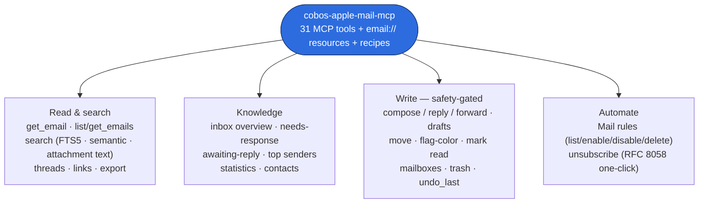
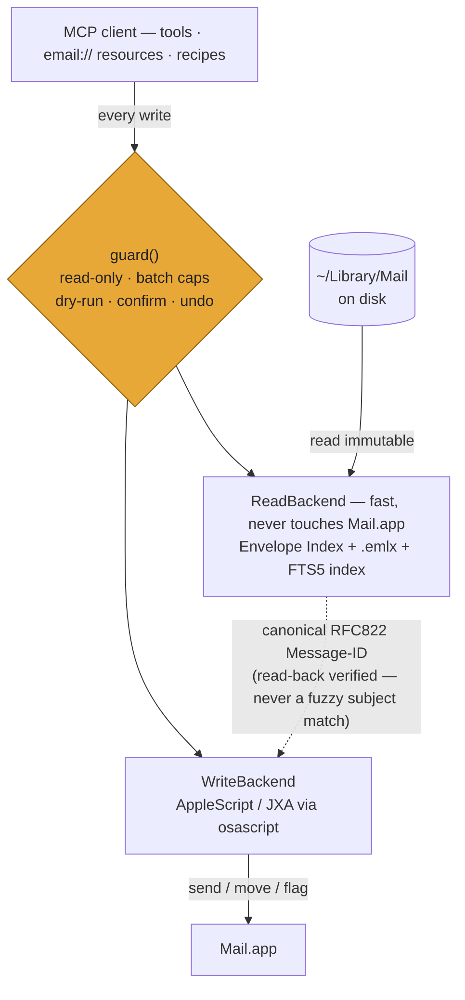

<p align="center">
  
</p>

<p align="center">
  <a href="https://pypi.org/project/cobos-apple-mail-mcp/"></a>
  
  
  
  <a href="https://github.com/ErnestoCobos/cobos-apple-mail-mcp/blob/main/LICENSE"></a>
</p>

# cobos-apple-mail-mcp

**A unified Apple Mail MCP server: fast on-disk reads and search, plus complete AppleScript
writes, behind one safety layer.** GPL-3.0-or-later. By Ernesto Cobos
([@ErnestoCobos](https://github.com/ErnestoCobos)).

```
search "budget review" --highlight     →  ~ms, full-mailbox, BM25-ranked
get_inbox_overview                     →  ~ms, computed from a local index
move_email + undo_last                 →  AppleScript, resolved by Message-ID, reversible
```

Full depth lives in the **[GitHub Wiki](https://github.com/ErnestoCobos/cobos-apple-mail-mcp/wiki)**
(architecture, on-disk format, every tool's parameters, configuration reference, troubleshooting).
This README is the quickstart and the pitch.

## Install in 30 seconds

```bash
uvx cobos-apple-mail-mcp --help        # try it with zero install (uv)
# or install it:  pipx install cobos-apple-mail-mcp
apple-mail-mcp init && apple-mail-mcp index build   # config + build the local index
```

Then register `apple-mail-mcp serve` with your MCP client (Claude Desktop / Code, Codex, Kimi) —
[jump to the per-client blocks](#register-with-your-mcp-client). Full walkthrough:
[Getting started](#getting-started-5-minute-walkthrough). One-time macOS permissions
(Full Disk Access + Automation) are covered there.

## What you get — 31 tools in one server



---

## What it is, and how it works

Apple Mail MCP servers split into two families, and neither half alone is enough for an agent
that needs to actually *do* email work:

- **Read-only servers** read `~/Library/Mail` directly (the `Envelope Index` SQLite database +
  `.emlx` files) for millisecond-fast search, but can't send, move, or flag anything.
- **Write-capable servers** drive Mail.app via AppleScript/JXA — correct for writes, but every
  *read* also goes through Mail.app scripting, which is 100-1000x slower than reading the files
  directly, and full-text body search across the whole mailbox usually isn't offered at all.

`cobos-apple-mail-mcp` runs both paths in one server:



Reads never touch Mail.app at all — they query a local FTS5 index built from the same on-disk
data Mail itself uses, kept fresh by an incremental `--watch` updater. Writes go through
AppleScript/JXA (the only correct way to make Mail.app send/move/flag anything), with every
target message resolved by its canonical Message-ID and **read-back verified** before any
mutation — never picked by a fuzzy subject match. See
[Architecture](https://github.com/ErnestoCobos/cobos-apple-mail-mcp/wiki/Architecture) for the
full design.

## Why it's better than the alternatives

| | Read speed | Full-mailbox body search | Writes | Message targeting | Safety layer | Knowledge/triage |
|---|---|---|---|---|---|---|
| **Read-only servers** (e.g. imdinu/apple-mail-mcp) | Fast (disk-direct) | Yes | **None** | n/a | n/a | No |
| **Write-only servers** (e.g. patrickfreyer/apple-mail-mcp) | Slow (AppleScript) | Limited/none | Yes | **Subject substring — can hit the wrong message** | Partial (batch caps, some dry-run) | Heuristic, AppleScript-computed |
| **cobos-apple-mail-mcp** | Fast (disk-direct) | Yes (FTS5, optional semantic) | Yes (AppleScript) | **Canonical Message-ID, read-back verified** | Mandatory: read-only mode, batch caps, dry-run, confirm, honest undo | Heuristic, index-computed (fast) |

Concretely, this project is the union of both upstreams' strengths plus three things neither
had:

1. **An identity bridge that can't silently act on the wrong message.** Every write resolves
   the target by RFC822 Message-ID, scoped by hints/cache/the read layer's own context, then
   **verifies the match by reading its Message-ID back** before mutating anything. If more than
   one message matches, the server returns `MultipleMatches` and asks for disambiguation — it
   never guesses. This directly replaces the fragile `subject_keyword` substring matching used
   by the write-capable upstream, which can hit the wrong message in a thread with repeated
   subjects.
2. **A mandatory safety layer**, not an optional convention: `--read-only` disables every
   send/modify tool (draft creation stays allowed); batch limits *reject* oversized requests
   instead of silently truncating them; `dry_run` previews with zero mutation; permanent
   delete/empty-trash require `confirm=true`; reversible writes (move, trash, flag/status) are
   journaled so `undo_last()` can reverse them — and the server is honest that sends and
   permanent deletes are **not** undoable, rather than pretending otherwise.
3. **Never hangs.** Every `osascript`/JXA call runs in its own process group with a hard timeout
   and is killed outright on expiry — bypassing Apple Events' own ~2-minute default wait. Reads
   never depend on Mail.app being responsive at all. `--read-only` blocks fail in milliseconds,
   before any AppleScript call is even attempted.

## Performance

Measured against a real 7-account, 210,152-message mailbox (not a synthetic benchmark):

- Single `get_email` fetch: low single-digit milliseconds (reads one `.emlx` file).
- Full-mailbox `search` for a realistic, selective term (`"invoice"`, or `"meeting"` scoped to
  subject): **9-20ms**, BM25-ranked. This is the common case.
- A deliberately non-selective single-word query matching a large fraction of the whole corpus
  (e.g. `"the"`, matching ~39% of all 210k messages here) is **not** sub-100ms — BM25 has to rank
  tens of thousands of candidates before returning the top page, observed at 0.3-1.6s depending on
  system load. Real queries are essentially never this unselective; this is a documented edge
  case, not a hidden one.
- First `index build --full`: one-time, ~3ms/message (679.6s / 210,152 messages here) — includes
  HTML→text conversion and full JWZ re-threading, not just parsing. Every build after that is
  incremental (`index build` without `--full`, or `--watch`) and only touches what changed.
- Index build (incremental) is far faster than scripting Mail.app for the same scan, because it
  never launches AppleScript — it walks changed `.emlx` files and an immutable SQLite read
  directly.
- `--watch` incremental updates: new mail typically reflected in the index within a couple of
  seconds of arrival, debounced and batched.

## Why each major choice (one line each — full rationale in the Wiki and RESEARCH.md)

- **Immutable Envelope Index reads** — `file:...?immutable=1` sidesteps SQLite locking instead
  of racing Mail.app for it; the `.emlx` file is the authoritative source for everything anyway.
- **FTS5, not a heavier engine** — verified against Tantivy/DuckDB/Spotlight/vector-native
  stores for this exact architecture (embedded, single-user, hybrid-ready); nothing else won
  outright. Wrapped behind a `SearchBackend` seam in case that ever changes.
- **Apple `NaturalLanguage` as the default semantic backend** — built into macOS, zero model
  download, the most resource-frugal option available; MiniLM is an opt-in fallback.
- **Never-hang as a first-class invariant** — every external call (subprocess, broad scan) is
  bounded; nothing in this server can leave an MCP client waiting indefinitely.
- **GPL-3.0-or-later** — the read engine's architecture derives from a GPL-3.0 upstream; see
  [NOTICE](NOTICE).

## Getting started (5-minute walkthrough)

This walks through everything from a clean checkout to asking your MCP client a real question
about your inbox.

**1. Install and grant permissions.** `pipx install cobos-apple-mail-mcp` (see
[Install](#install) below for alternatives), then grant **Full Disk Access** to your
terminal/MCP client host and **Automation** access to Mail.app — System Settings → Privacy &
Security. Full walkthrough with screenshots-equivalent steps:
[Permissions & troubleshooting](https://github.com/ErnestoCobos/cobos-apple-mail-mcp/wiki/Permissions-and-troubleshooting).
You can skip this step to try read-only search first — indexing only needs Full Disk Access,
not Automation.

**2. Initialize config.**

```bash
$ apple-mail-mcp init
wrote /Users/you/.cobos-apple-mail-mcp/config.toml
```

Open that file if you want to exclude a mailbox, cap batch sizes further, or turn on semantic
search — every option is commented inline. Defaults work for most setups.

**3. Build the index.** First run reads every `.emlx` file on disk once; after that,
`apple-mail-mcp watch` keeps it current incrementally.

```bash
$ apple-mail-mcp index build --full
{
  "added": 210152,
  "changed": 0,
  "deleted": 0,
  "moved": 0,
  "failed": 0,
  "duration_sec": 679.6,
  "full": true
}
```

(Real numbers from a first full build against a 7-account, 210k-message mailbox on this project's
own dev machine — about 11 minutes, or ~3ms/message, one-time. A mailbox in the low thousands
finishes in a few seconds. `--watch` (or a plain `index build` without `--full` afterwards) is
incremental from here — only new/changed/deleted mail gets reparsed, typically reflected within a
couple of seconds. `failed` counts messages that couldn't be parsed at all; a handful is normal
across years of varied real-world mail — inspect them anytime with `apple-mail-mcp index status`,
they're dead-lettered and never block the rest of the build.)

**4. Confirm it's live.**

```bash
$ apple-mail-mcp index status
{
  "mail_dir": "/Users/you/Library/Mail/V10",
  "envelope_index_available": true,
  "total_indexed": 210152,
  "pending_added": 0,
  "pending_changed": 0,
  "stale": false,
  ...
}
```

**5. Search it.**

```bash
$ apple-mail-mcp search "invoice" --scope subject --highlight --limit 3
{
  "query": "invoice",
  "mode": "keyword",
  "scope": "subject",
  "total_estimated": 14,
  "returned": 3,
  "timing_ms": 3.2,
  "hits": [
    {
      "message_ref": {"message_id": "abc123@vendor.example.com", "account": "Work", "mailbox": "INBOX"},
      "score": 9.4,
      "subject": "Your <mark>invoice</mark> #4471 is ready",
      "sender_name": "Billing",
      "sender_addr": "billing@vendor.example.com",
      "date_received": 1782950400,
      "is_read": true,
      "snippet_html": "Attached is your <mark>invoice</mark> for this billing period..."
    }
  ]
}
```

Sub-100ms, full-mailbox, no Mail.app scripting involved. Try `apple-mail-mcp overview` or
`apple-mail-mcp awaiting-reply` next — both are computed instantly from the same local index.

**6. Register with your MCP client** — see [Register with your MCP client](#register-with-your-mcp-client)
below for Claude Desktop / Claude Code / Codex / Kimi. After restarting the client, try asking
it something like:

> "What's in my inbox that still needs a reply?"

The client calls `get_needs_response` (or `get_awaiting_reply`) under the hood, gets back
ranked, structured results in milliseconds, and answers from those — no email content needed to
round-trip through a slow AppleScript read first. Ask it to draft a reply to one of them and it
calls `reply_to_email` in draft mode; nothing sends without you reviewing it in Mail.app first
(and nothing sends *at all* if you registered with `--read-only`).

**7. Try a bundled recipe** — the fastest way to see the knowledge layer in action:

```bash
$ apple-mail-mcp recipe run daily-triage
```

or, from your MCP client, just ask for your "daily triage" — recipes are registered as MCP
prompts, so the client can invoke them by name. See
[Resources and prompts/recipes](https://github.com/ErnestoCobos/cobos-apple-mail-mcp/wiki/Resources-and-prompts-recipes)
for the other four (`inbox-zero`, `awaiting-reply`, `weekly-review`, `thread-catchup`) and how to
write your own.

## Install

The whole path, from install to asking your agent about your inbox:


### Requirements

- macOS, with Apple Mail configured with at least one account.
- Python 3.10+.
- **Full Disk Access** for your terminal/MCP client host (to read `~/Library/Mail` for indexing)
  and **Automation** permission for Mail.app (to script writes) — System Settings → Privacy &
  Security. Full instructions:
  [Permissions & troubleshooting](https://github.com/ErnestoCobos/cobos-apple-mail-mcp/wiki/Permissions-and-troubleshooting).

### uvx / pipx / pip

`uvx` is the zero-install path most MCP clients use — it fetches and runs on demand:

```bash
uvx cobos-apple-mail-mcp serve            # run the server directly (no install)

# or install a persistent CLI:
pipx install cobos-apple-mail-mcp         # or: pip install cobos-apple-mail-mcp
# with optional PDF/DOCX attachment-text search:
pipx install "cobos-apple-mail-mcp[attachments]"

apple-mail-mcp init          # writes ~/.cobos-apple-mail-mcp/config.toml
apple-mail-mcp index build   # first full index build
apple-mail-mcp index status
```

### Single file (`.pyz`)

No `pip install` needed — just a matching Python 3.10+ on `$PATH` (run it with the **same Python
minor version** the release was built with — e.g. `python3.12`; the release notes say which one.
This is a verified, not theoretical, requirement: the `.pyz` bundles a compiled dependency tied
to that exact ABI):

```bash
curl -LO https://github.com/ErnestoCobos/cobos-apple-mail-mcp/releases/latest/download/apple-mail-mcp.pyz
python3.12 apple-mail-mcp.pyz init
python3.12 apple-mail-mcp.pyz index build
```

See [Single-file packaging](https://github.com/ErnestoCobos/cobos-apple-mail-mcp/wiki/Single-file-packaging)
for how to build this yourself (`make pyz`) and the `apple-mail-mcp-full.pyz` variant that bundles
`[watch]`+`[semantic]`.

### Register with your MCP client

> **One command for Claude Desktop / Cowork:** [`scripts/install.sh`](scripts/install.sh)
> installs the CLI, writes the config, offers to build the index, and registers the server for
> you — backing up `claude_desktop_config.json` and merging in only the one entry, so your other
> MCP servers are untouched:
> ```bash
> bash scripts/install.sh                      # add --read-only, --with-attachments, --help
> # Claude Desktop only (skips the Claude Code CLI step):
> bash scripts/install-claude-desktop.sh
> ```
> Everything below is the manual path.

Test first with the official inspector:

```bash
npx @modelcontextprotocol/inspector apple-mail-mcp serve
```

**Claude Desktop & Cowork** — the desktop app (and its Cowork workspace) load local servers from
one file. Edit it (Settings → Developer → Edit Config, or directly)
`~/Library/Application Support/Claude/claude_desktop_config.json`, adding `apple-mail` next to any
servers you already have:

```json
{
  "mcpServers": {
    "apple-mail": {
      "command": "apple-mail-mcp",
      "args": ["serve"]
    }
  }
}
```

Restart Claude Desktop completely (Cmd-Q, then reopen) after editing — the same app serves Cowork,
so it's registered there too. If the app can't find `apple-mail-mcp`, use the absolute path from
`which apple-mail-mcp`, and grant **Claude Desktop itself** Full Disk Access. (Single-file variant:
`"command": "python3.12", "args": ["/absolute/path/apple-mail-mcp.pyz", "serve"]` — use the Python
minor version that built the `.pyz`, not just any `python3`; see [Single-file packaging](https://github.com/ErnestoCobos/cobos-apple-mail-mcp/wiki/Single-file-packaging).)

**Claude Code (CLI)** — also drives Cowork automations:

```bash
claude mcp add apple-mail -- apple-mail-mcp serve
claude mcp list   # verify
```

For a team-shared registration, use `--scope project` (writes to `.mcp.json` in the repo).

**OpenAI Codex CLI** — add to `~/.codex/config.toml`:

```toml
[mcp_servers.apple-mail]
command = "apple-mail-mcp"
args = ["serve"]
startup_timeout_sec = 10
```

or: `codex mcp add apple-mail -- apple-mail-mcp serve`

**Kimi CLI (Moonshot)** — add to `~/.kimi/mcp.json`:

```json
{
  "mcpServers": {
    "apple-mail": { "type": "stdio", "command": "apple-mail-mcp", "args": ["serve"] }
  }
}
```

or: `kimi mcp add apple-mail -- apple-mail-mcp serve`, then `kimi mcp test apple-mail`.

Full per-client details, troubleshooting, and absolute-path notes:
[Install per client](https://github.com/ErnestoCobos/cobos-apple-mail-mcp/wiki/Install-per-client).

### Read-only mode

```bash
apple-mail-mcp --read-only serve
```

Disables every send/modify tool (draft creation stays allowed). Useful for a first install, or
any time you want search/triage without write access.

## CLI usage

Every tool is also a standalone CLI subcommand with JSON output:

```bash
apple-mail-mcp search "invoice" --scope subject --highlight
apple-mail-mcp emails --filter unread --limit 20
apple-mail-mcp thread --message-id "abc123@example.com"
apple-mail-mcp overview
apple-mail-mcp awaiting-reply --days-back 14
apple-mail-mcp move m1@example.com --to-mailbox Archive --dry-run
apple-mail-mcp move m1@example.com --to-mailbox Archive
apple-mail-mcp undo-last
apple-mail-mcp recipe run daily-triage --arg account=Work
```

Full reference: [Tools reference](https://github.com/ErnestoCobos/cobos-apple-mail-mcp/wiki/Tools-reference).

## Documentation

- [GitHub Wiki](https://github.com/ErnestoCobos/cobos-apple-mail-mcp/wiki) — architecture,
  on-disk format, identity/resolution, safety/undo, indexing & watch, search, threading &
  knowledge, every tool's parameters, resources & recipes, configuration reference, permissions
  & troubleshooting, single-file packaging, install per client, performance, development.
- [RESEARCH.md](RESEARCH.md) — the Phase 0 research this design is based on.
- [CLAUDE.md](CLAUDE.md) — project memory: invariants, knowledge map, conventions.

## License & attribution

GPL-3.0-or-later. This project merges architectural ideas and, in places, adapted code from
[imdinu/apple-mail-mcp](https://github.com/imdinu/apple-mail-mcp) (GPL-3.0) and
[patrickfreyer/apple-mail-mcp](https://github.com/patrickfreyer/apple-mail-mcp) (MIT) — see
[NOTICE](NOTICE) for full attribution. All original work (the identity bridge, safety/undo
layer, knowledge/triage layer, and packaging) is by Ernesto Cobos.
