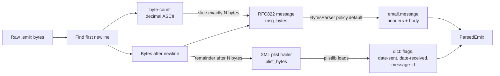
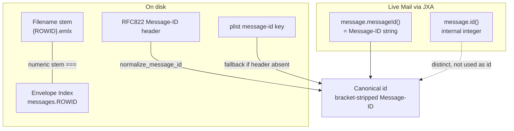
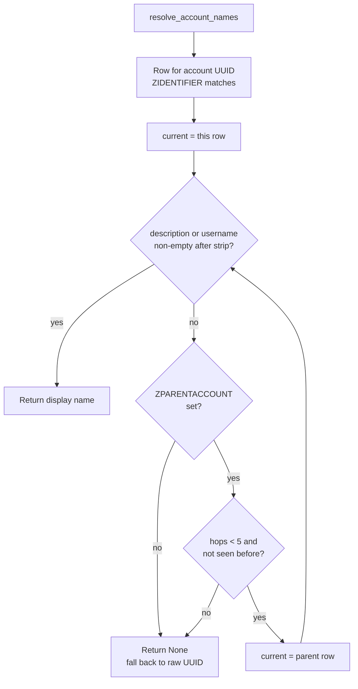

---
covers:
  - src/cobos_apple_mail_mcp/read/envelope_reader.py
  - src/cobos_apple_mail_mcp/read/emlx_parser.py
last_verified: 2026-06-30
---

# Apple Mail on-disk format

## Location & versioning

```
~/Library/Mail/V{N}/
```

`N` has been 8 (Big Sur), 9 (Monterey), 10 (Ventura/Sonoma/Sequoia) — multiple version
directories can coexist on an upgraded system. `read/envelope_reader.py::find_mail_directory()`
picks the highest `V{N}` present.

```
~/Library/Mail/V10/
├── MailData/
│   ├── Envelope Index            # SQLite3 — supplementary metadata only
│   ├── Envelope Index-wal/-shm   # WAL files — never opened by this project
│   └── ...
└── {Account-UUID}/                # one directory per account
    └── {Mailbox}.mbox/
        └── 0/0/                   # numbered partition directories
            ├── Messages/
            │   ├── {ROWID}.emlx
            │   └── {ROWID}.partial.emlx
            └── Attachments/{ROWID}/{n}/{filename}
```

Nested mailboxes (e.g. "Archive/2024") are derived by walking up from a `Messages/` directory to
the nearest `.mbox` ancestor (`read/indexer.py::_mbox_chain()`), which correctly handles an
arbitrary number of non-`.mbox` directories in between without double-counting.

## The Envelope Index SQLite database

Undocumented, reverse-engineered, and has drifted across macOS releases. Key tables: `messages`
(ROWID, date_received, date_sent, flags, sender/subject/mailbox foreign keys), `addresses`,
`subjects`, `mailboxes`, `recipients`.

**Timestamps are Cocoa-epoch**, not Unix epoch: seconds since 2001-01-01T00:00:00Z. Convert with
`read/envelope_reader.py::apple_to_unix()` (adds `978307200`, the `COCOA_EPOCH_OFFSET`).

This project opens it `file:{path}?immutable=1` — strictly read-only, and `immutable=1` skips
SQLite's locking protocol entirely (safe because we never write, and it means a busy Mail.app can
never block or be blocked by these reads). It is treated as a **best-effort supplementary
source only** (`read_envelope_flags()` defensively introspects `PRAGMA table_info` before
trusting any column) — the indexer never requires it to be present or correctly shaped, because
the `.emlx` file is the authoritative source for everything this project needs.

## The `.emlx` file format



_How parse_emlx_bytes splits a raw .emlx into its decimal byte-count header, the exact-length RFC822 message, and the trailing XML plist, then merges both into a ParsedEmlx._

```
<byte-count>\n<RFC822 message><XML plist trailer>
```

The first line is a decimal ASCII byte count covering exactly the RFC822 message that follows.
Whatever comes after that many bytes is an Apple property list (XML) with supplementary metadata:

```xml
<dict>
  <key>flags</key><integer>5</integer>
  <key>date-sent</key><real>700000000</real>
  <key>date-received</key><real>700000005</real>
</dict>
```

`flags` is a bitfield: bit0=`\Seen` (read), bit1=`\Answered`, bit2=`\Flagged`, bit3=`\Deleted`,
bit4=`\Draft` (`read/emlx_parser.py::FLAG_SEEN` etc.). Newsletter/bulk-mail detection
(`_looks_bulk()`) checks the RFC822 headers directly (`List-Unsubscribe`, `List-Id`, `List-Post`,
`Precedence: bulk|list|junk`, `Auto-Submitted`) rather than anything in the plist.

`.partial.emlx` files contain **headers only** — the body's attachments live in a sibling
`Attachments/{ROWID}/{n}/{filename}` tree instead of being inlined in the MIME body. The parser
(`read/emlx_parser.py::parse_emlx_bytes()`) detects this from the filename and reads attachment
names from that directory instead of walking MIME parts.

Parsing uses the stdlib `email` module with `policy.default`, which gives address-aware header
access (`msg.get("From").addresses` → `(display_name, addr_spec)` tuples) and `get_body()`/
`iter_attachments()` helpers — no hand-rolled MIME walking needed.

**Text sanitization.** `email.policy.default`'s lenient handling of malformed/non-UTF-8 headers
can leave lone UTF-16 surrogates in the decoded `str`; sqlite3 rejects those at insert time with
`UnicodeEncodeError`. Every string `parse_emlx_bytes()` extracts — subject, sender/recipient
name+addr, message id fields, body, attachment names — is swept through
`emlx_parser.py::_sanitize_text()` (`encode('utf-8', 'replace').decode('utf-8')`) before
`ParsedEmlx` is returned. Found by running a full index build against a real 209k-message,
multi-account mailbox for the first time — years of varied real-world mail hits encoding edge
cases synthetic test fixtures never do. `read/indexer.py::_flush_batch()` adds a second layer of
defense (see [Indexing and watch](https://github.com/ErnestoCobos/cobos-apple-mail-mcp/wiki/Indexing-and-watch)) in case anything still slips through.

## Flag colors

Apple Mail's seven colored flags are exposed via JXA as `message.flagIndex` (0-6, `-1` when
unflagged). `core/flags.py` maps those to color names — index 0=red confirmed empirically (a real
rule's `markFlagIndex=0` paired with `colorMessage="red"`), index 3=green confirmed by a live
set/cross-process-read round-trip against a real message.

**There is no reliable on-disk source for the per-flag color.** This was tested directly, not
assumed: setting a real message's `flagIndex` to each of 0-6 via JXA and reading the Envelope
Index's `flag_color` column back each time returned **1 every time** — the column is effectively a
flagged-boolean, not the flagIndex. (Immutable reads also lag live changes, since Mail buffers them
in the `-wal` before checkpointing.) So `flag_color` in this project's index is **only** populated
by our own `set_flag_color` write, which stores the correct `flagIndex` via an optimistic index
update (`write/organize.py::update_email_status`), and is **preserved across reindex** — the UPSERT
in `read/indexer.py` deliberately omits `flag_color` from its `ON CONFLICT` update, and new/parsed
rows start `NULL`. The honest consequence: colors set directly in the Mail.app UI are not
color-searchable (there's no trustworthy disk value to read); colors set through this server's tool
are. `set_flag_color` is undoable (the prior color is journaled) — see
[Safety, confirmation & undo](https://github.com/ErnestoCobos/cobos-apple-mail-mcp/wiki/Safety-confirmation-and-undo).

## The identity bridge: ROWID, Message-ID, and Mail's internal id



_The three identifiers for one message — the .emlx filename ROWID (== Envelope Index ROWID), the RFC822 Message-ID, and Mail's internal message.id() — and how only the normalized Message-ID becomes the project's canonical id._

Three distinct identifiers exist for the same message:

1. **Envelope Index `ROWID`** == the `.emlx` filename's numeric stem
   (`read/emlx_parser.py::rowid_from_filename()`). Fast, but volatile across an Envelope Index
   rebuild.
2. **RFC822 `Message-ID` header** — globally unique and permanent. Present in the `.emlx` plist
   (`message-id` key) and, for live messages, in Mail's own scripting object model.
3. **Mail's internal integer id** (JXA `message.id()`) — distinct from both of the above; JXA
   separately exposes `message.messageId()`, which *is* the RFC822 Message-ID string (with angle
   brackets).

This project's canonical id (exposed to every MCP tool) is the **normalized RFC822 Message-ID** —
see [Identity & resolution](https://github.com/ErnestoCobos/cobos-apple-mail-mcp/wiki/Identity-and-resolution) for the full design, including the
`amid:` opaque-handle fallback for drafts that don't have one yet.

## Account display names



_The bounded ZPARENTACCOUNT walk in resolve_account_names: check a row's stripped description/username, else hop to the parent account, capped at 5 hops with a cycle guard before falling back to the raw UUID._

The account UUID directory name has no human-readable counterpart anywhere in Apple Mail's own
on-disk data (no `accounts` table in the Envelope Index, `mailboxes.url` embeds only the UUID).
The real mapping lives in macOS's separate, system-wide Internet Accounts store,
`~/Library/Accounts/Accounts4.sqlite` — not Mail-specific (also backs Calendar/Contacts/Messages),
opened with the same `immutable=1` read-only discipline as the Envelope Index.

`read/account_names.py::resolve_account_names()`: `ZACCOUNT.ZIDENTIFIER` matches Mail's UUID
directory name directly, but **verified against a real 7-account mailbox, 4 of the 7 real
accounts had an empty `ZACCOUNTDESCRIPTION`/`ZUSERNAME` on their own row** — these are the
Gmail/Exchange-style accounts added via System Settings rather than directly in Mail. Their real
display name/email lives on a `ZPARENTACCOUNT` ancestor row instead; the resolver walks that
chain (bounded to 5 hops, with a cycle guard against malformed/circular data) until it finds a
row with a non-empty description or username. `read/indexer.py::build_index()` resolves this map
once per build and:

1. Threads it into `_row_from_parsed()` so newly-indexed rows get the real name immediately.
2. Runs a cheap indexed `UPDATE emails SET account_name = ... WHERE account_uuid = ...` per known
   account (`_backfill_account_names()`) on *every* build, not just `--full` — account-name
   resolution depends only on `account_uuid`, never message content, so already-indexed rows pick
   up the real name on the next build without a full reparse.

Falls back to the raw UUID on any missing file, schema mismatch, or permission error — this is a
best-effort supplementary lookup, never a hard requirement, matching
`envelope_reader.py::read_envelope_flags()`'s defensive style. Verified end-to-end: all 7 real
accounts on the verification mailbox resolved to their correct real names ("Account-A",
"Account-B", "Account-C", "On My Mac", "Account-D", "Account-F", "Account-E"), including one account
whose real `ZACCOUNTDESCRIPTION` had a stray leading space in the actual system data — stripped
before use.
