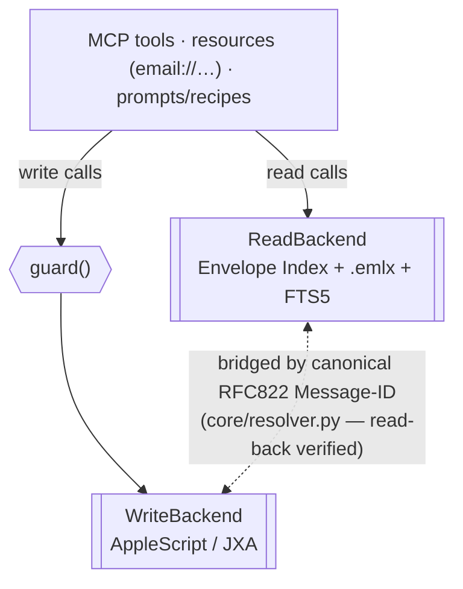
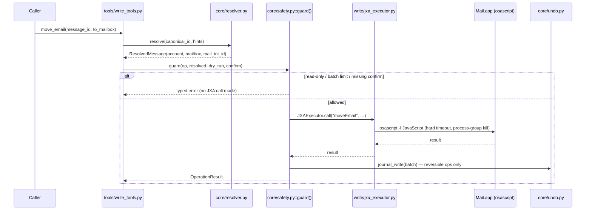

---
covers:
  - src/cobos_apple_mail_mcp/server.py
  - src/cobos_apple_mail_mcp/write/*.py
last_verified: 2026-06-30
---

# Architecture



*(Mermaid diagram — if it doesn't render in your viewer: reads flow from MCP tools straight into
`ReadBackend`; every write flows through `guard()` first, then into `WriteBackend`; the two
backends are bridged by the canonical Message-ID resolver.)*

## The dual-path design

**Reads** never touch Mail.app. `read/envelope_reader.py` opens the live `Envelope Index`
SQLite database `immutable=1` (read-only, no locking) purely as a supplementary metadata source;
the authoritative data comes from parsing `.emlx` files directly (`read/emlx_parser.py`). Both
feed a derived, disposable `index.db` (`storage/`) — FTS5 keyword search, optional vector search,
JWZ threading, and triage all read from this index, never from Mail.app. `index.db` is always
rebuildable from disk (`index rebuild`); nothing non-reconstructable is stored there except the
undo journal (action metadata, never message content).

**Writes** go through AppleScript/JXA (`write/jxa_executor.py` running `osascript -l
JavaScript`), because that's the only documented, correct way to make Mail.app send, move, flag,
or delete anything — there is no general public API for mutating a mailbox. Every write tool
(`write/compose.py`, `write/drafts.py`, `write/organize.py`, `write/attachments.py`) is a thin
wrapper that resolves its target via `core/resolver.py`, then passes through
`core/safety.py::guard()` before mutating anything.

## Read → write flow for one write call (e.g. `move_email`)



1. `tools/write_tools.py::move_email()` is called with a canonical `message_id`.
2. `core/resolver.py::resolve()` turns that id into a `ResolvedMessage` (account_name,
   mailbox_name, mail_int_id) — scoped by hint → cache → the read layer's own context → a bounded
   broad scan, with **mandatory read-back verification** (see
   [Identity & resolution](https://github.com/ErnestoCobos/cobos-apple-mail-mcp/wiki/Identity-and-resolution)).
3. `core/safety.py::guard()` checks `--read-only`, batch limits, `dry_run`, and `confirm` —
   *before* any JXA call when the request is going to be rejected anyway (read-only fails in
   milliseconds, never touching `osascript`).
4. The actual mutation calls `write/jxa_executor.py::JXAExecutor.call()`, which runs one
   `osascript` invocation against `write/scripts/mail_core.js` with a hard timeout and
   process-group kill on expiry.
5. On success, `guard()` journals the change (`core/undo.py`) if it's a reversible operation
   (move/trash/status/flag — never send/permanent-delete).

## Module layout

```
src/cobos_apple_mail_mcp/
├── server.py, cli.py, config.py        # FastMCP app, CLI, config
├── core/                                # identity, resolution, safety, undo, flags, shared models/errors
├── storage/                             # index.db connection + schema migrations
├── read/                                # envelope reader, .emlx parser, indexer, watcher,
│                                         #   FTS5/trigram/vector search, JWZ threader, account names
├── knowledge/                           # analytics, triage, contacts (list + profile) — all over index.db
├── write/                               # JXA executor + scripts, compose, drafts, organize,
│                                         #   attachments, rules, unsubscribe
├── tools/                               # thin MCP tool wrappers over read/write/knowledge
├── resources/                           # email://… resource registration
└── skills/                              # recipe loader + 5 bundled recipes (MCP prompts)
```

See [CLAUDE.md](https://github.com/ErnestoCobos/cobos-apple-mail-mcp/blob/main/CLAUDE.md) for the
full subsystem → source → page knowledge map.

## No focus-dependent UI automation

Rich/HTML email composition does **not** use simulated keystrokes or NSPasteboard injection (a
pattern used by some prior art that can hang if a window loses focus). Instead, a proper
multipart MIME message is built with the stdlib `email` module and opened as a Mail draft via
`open -a Mail <path>.eml` — a real, reliable OS-level file-open, not UI automation. This is also
why HTML-body sends are always opened as a draft for review rather than auto-sent: Mail's
scripting dictionary has no "send this freshly-imported draft" hook.
