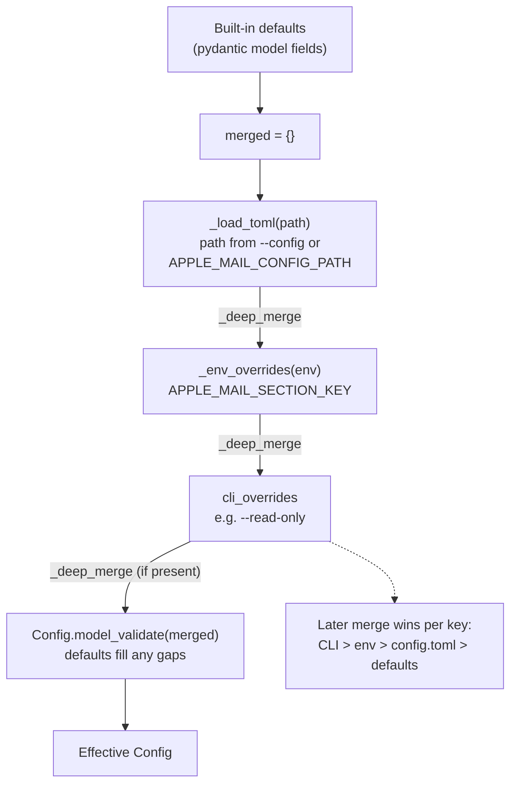
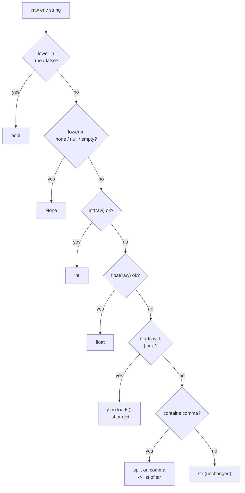

---
covers:
  - src/cobos_apple_mail_mcp/config.py
last_verified: 2026-06-30
---

# Configuration reference



_load_config layers config.toml, then APPLE_MAIL_* env overrides, then CLI overrides via successive _deep_merge calls, so each later source wins per key before Config.model_validate fills remaining gaps with defaults._

Precedence: **CLI flags > `APPLE_MAIL_*` env vars > `config.toml` > built-in defaults.**
Implemented by hand (`config.py::load_config()`) rather than via pydantic-settings' env-binding
magic, so the merge order is explicit and easy to test without touching real environment state.

Generate a fully-commented starter file: `apple-mail-mcp init` (writes
`~/.cobos-apple-mail-mcp/config.toml`; `--force` to overwrite). A static copy lives at
`config.toml.example` in the repo root.

## `[defaults]`

| Key | Default | Meaning |
|---|---|---|
| `account` | unset | default account name when a tool call omits one |
| `mailbox` | `"INBOX"` | default mailbox when a tool call omits one |

## `[index]`

| Key | Default | Meaning |
|---|---|---|
| `path` | `~/.cobos-apple-mail-mcp/index.db` | the derived FTS5/search index — always rebuildable from disk |
| `max_emails` | unset | optional per-mailbox indexed-email cap |
| `staleness_hours` | `24.0` | `index status` flags the index stale past this age |
| `exclude_mailboxes` | `["Drafts"]` | mailbox names to skip indexing |
| `include_mailboxes` | unset | if set, index *only* these mailbox names |
| `exclude_accounts` | `[]` | account names/UUIDs to skip indexing |
| `enable_trigram` | `false` | build the substring-search companion table (`emails_trgm`); ~doubles index size; only refreshed on `index rebuild` |

## `[server]`

| Key | Default | Meaning |
|---|---|---|
| `read_only` | `false` | disable every send/modify write tool (draft creation stays allowed) |

## `[batch_limits]`

Per-call ceilings — exceeding **rejects** the call, never silently truncates.

| Key | Default |
|---|---|
| `move` | `1` |
| `status` | `10` |
| `trash` | `5` |
| `delete` | `1` |

## `[confirmation]`

| Key | Default |
|---|---|
| `require_confirm` | `["permanent_delete", "empty_trash", "delete_rule"]` |

`delete_rule` is listed for discoverability, but its confirmation is enforced in code regardless of
this list — a deleted rule can't be recreated via Mail's scripting, so an older `config.toml` can't
opt out of the gate (see [Safety](https://github.com/ErnestoCobos/cobos-apple-mail-mcp/wiki/Safety-confirmation-and-undo#non-batch-writes-rule-lifecycle-gate_nonbatch)).

## `[embeddings]`

| Key | Default | Meaning |
|---|---|---|
| `enabled` | `false` | turns on the optional semantic/hybrid search layer (requires `[semantic]` extra) |
| `backend` | `"apple_nl"` | `apple_nl` (Apple NaturalLanguage via PyObjC, no download) or `minilm` (ONNX, requires `[semantic-minilm]` + a local model dir) |
| `model` | unset | only used when `backend = "minilm"` — a local directory containing `model.onnx` + `tokenizer.json` |

## `[attachments]`

| Key | Default | Meaning |
|---|---|---|
| `extract_text` | `false` | extract PDF/DOCX text so `search(scope=attachments)` matches content, not just filenames (requires the `[attachments]` extra; backfill via `apple-mail-mcp index extract-attachments` or a couple of batches per `--watch` tick) |
| `max_file_size_mb` | `25` | skip attachments larger than this to bound per-file extraction cost |

## `[timeouts]`

The never-hang knobs — every external call is bounded by one of these.

| Key | Default | Meaning |
|---|---|---|
| `jxa_call_sec` | `20.0` | hard timeout for one `osascript` call (process-group-killed on expiry) |
| `broad_scan_sec` | `30.0` | reserved for bounding the resolver's last-resort broad scan |
| `mail_launch_sec` | `15.0` | how long to wait for Mail.app to become scriptable after launching it |
| `http_sec` | `15.0` | hard timeout for the RFC-8058 one-click unsubscribe `POST` (the never-hang rule applies to network calls too) |

## `APPLE_MAIL_*` environment variables



__coerce_env_value tries each conversion in order — bool, None, int, float, JSON for [ or { prefixes, comma-split list — and falls through to the raw string when none match._

Flat naming: `APPLE_MAIL_<SECTION>_<KEY>`, e.g.:

```bash
APPLE_MAIL_SERVER_READ_ONLY=true
APPLE_MAIL_INDEX_PATH=/custom/path/index.db
APPLE_MAIL_BATCH_LIMITS_MOVE=3
APPLE_MAIL_EMBEDDINGS_ENABLED=true
APPLE_MAIL_CONFIG_PATH=/custom/path/config.toml   # overrides which config.toml is loaded
```

Values are coerced: `true`/`false` → bool, numeric strings → int/float, `[...]`/`{...}` → JSON,
comma-containing strings → a list, everything else stays a string
(`config.py::_coerce_env_value()`).

## CLI overrides

`--read-only` (sets `server.read_only=true`) and `--config <path>` are the only global CLI flags
that affect config resolution; every other CLI flag is per-command (e.g. `--dry-run`,
`--max-moves`) and doesn't go through this precedence chain at all.
