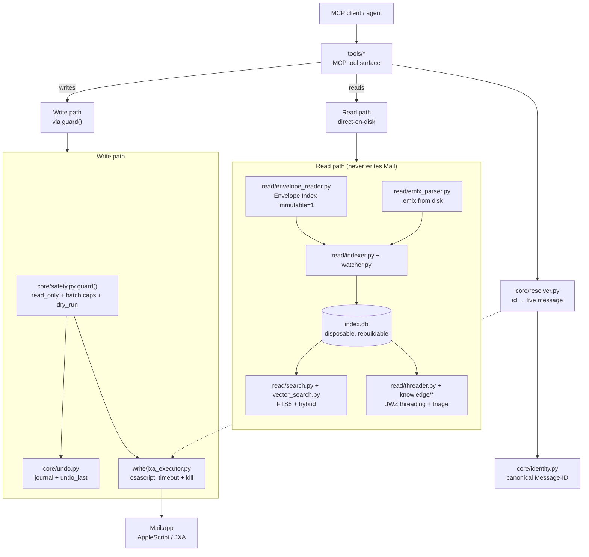

# cobos-apple-mail-mcp Wiki

Unified Apple Mail MCP server — fast on-disk reads/search plus complete AppleScript writes,
behind one safety layer. Author: Ernesto Cobos. License: GPL-3.0-or-later.

This Wiki is the deep documentation; the [README](https://github.com/ErnestoCobos/cobos-apple-mail-mcp#readme)
is the quickstart and pitch. [CLAUDE.md](https://github.com/ErnestoCobos/cobos-apple-mail-mcp/blob/main/CLAUDE.md)
is the fast-routing index for anyone (human or agent) working on the code itself.

_High-level subsystem map: an MCP client hits tools/*, which resolve a canonical Message-ID via core/resolver.py and split into a direct-on-disk read path (Envelope Index and .emlx feeding the disposable index.db for search and threading) and a write path that always passes through core.safety.guard() before write/jxa_executor.py drives Mail.app._

## Pages

- **[Architecture](https://github.com/ErnestoCobos/cobos-apple-mail-mcp/wiki/Architecture)** — the dual-path design, the diagram, the read→write flow,
  module map.
- **[Apple Mail on-disk format](https://github.com/ErnestoCobos/cobos-apple-mail-mcp/wiki/Apple-Mail-on-disk-format)** — Envelope Index schema,
  `.emlx`/`.partial.emlx` layout, ROWID↔Message-ID mapping, Cocoa-epoch timestamps, version
  directories.
- **[Identity & resolution](https://github.com/ErnestoCobos/cobos-apple-mail-mcp/wiki/Identity-and-resolution)** — the canonical-id design, the
  resolver algorithm, `MultipleMatches`, the `resolve_cache`.
- **[Safety, confirmation & undo](https://github.com/ErnestoCobos/cobos-apple-mail-mcp/wiki/Safety-confirmation-and-undo)** — `guard()`, batch caps,
  dry_run/confirm, the undo journal and its honest limits.
- **[Indexing and watch](https://github.com/ErnestoCobos/cobos-apple-mail-mcp/wiki/Indexing-and-watch)** — the inventory-diff algorithm, crash-safe
  bulk build, the `--watch` loop, dead-letter handling, staleness.
- **[Search](https://github.com/ErnestoCobos/cobos-apple-mail-mcp/wiki/Search)** — the FTS5 schema, BM25 weights, scopes, the `SearchBackend` seam,
  trigram, hybrid/semantic search.
- **[Threading and knowledge](https://github.com/ErnestoCobos/cobos-apple-mail-mcp/wiki/Threading-and-knowledge)** — JWZ threading, the
  awaiting-reply/needs-response heuristics, analytics.
- **[Tools reference](https://github.com/ErnestoCobos/cobos-apple-mail-mcp/wiki/Tools-reference)** — every tool's parameters, output shape, and backend.
- **[Resources and prompts-recipes](https://github.com/ErnestoCobos/cobos-apple-mail-mcp/wiki/Resources-and-prompts-recipes)** — the `email://...`
  resources and how to author/run a recipe.
- **[Configuration reference](https://github.com/ErnestoCobos/cobos-apple-mail-mcp/wiki/Configuration-reference)** — `config.toml`, `APPLE_MAIL_*` env
  vars, precedence, every setting.
- **[Permissions and troubleshooting](https://github.com/ErnestoCobos/cobos-apple-mail-mcp/wiki/Permissions-and-troubleshooting)** — Full Disk Access,
  Automation, common errors.
- **[Single-file packaging](https://github.com/ErnestoCobos/cobos-apple-mail-mcp/wiki/Single-file-packaging)** — building and running
  `apple-mail-mcp.pyz`.
- **[Install per client](https://github.com/ErnestoCobos/cobos-apple-mail-mcp/wiki/Install-per-client)** — Claude Desktop/Cowork, Codex, Kimi, plus the
  MCP Inspector.
- **[Performance and benchmarks](https://github.com/ErnestoCobos/cobos-apple-mail-mcp/wiki/Performance-and-benchmarks)** — methodology and numbers.
- **[Development and contributing](https://github.com/ErnestoCobos/cobos-apple-mail-mcp/wiki/Development-and-contributing)** — testing without a Mac,
  CI, release process.

## Knowledge map (subsystem → source → page)

The authoritative copy of this table lives in
[CLAUDE.md](https://github.com/ErnestoCobos/cobos-apple-mail-mcp/blob/main/CLAUDE.md) — it's the
fast routing index used when working on the code; this Wiki is where each row's page actually
lives.
