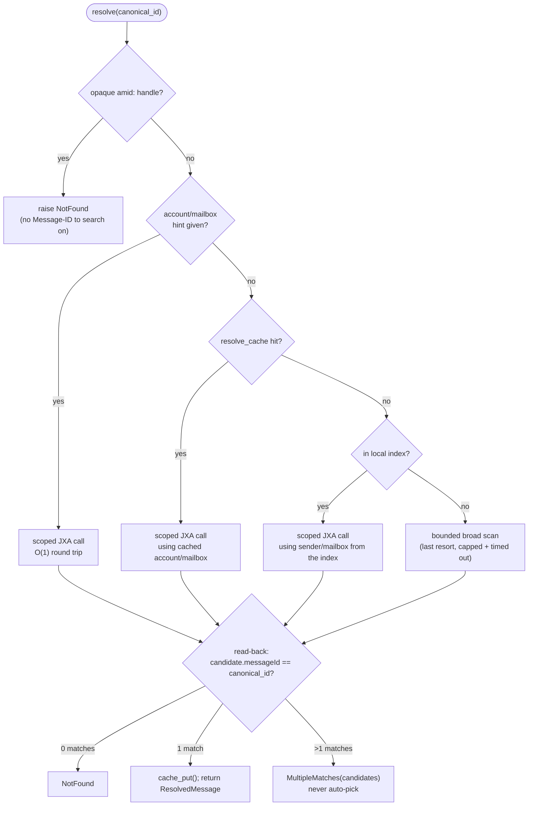

---
covers:
  - src/cobos_apple_mail_mcp/core/identity.py
  - src/cobos_apple_mail_mcp/core/resolver.py
last_verified: 2026-06-30
---

# Identity & resolution

This is the correctness-critical core of the server (CLAUDE.md invariant #1) — the bridge
between the fast-read path and the AppleScript/JXA write path, designed so a write can never
silently act on the wrong message.

## Canonical id

`core/identity.py::normalize_message_id()` produces the canonical form of an RFC822 Message-ID:
bracket-stripped, whitespace-trimmed, **case preserved** (RFC 5322 msg-id halves are
case-sensitive tokens — never lowercased). Both bracketed (`<abc@x.com>`) and bare (`abc@x.com`)
input are accepted; the canonical form is always bare. `to_mail_message_id()` re-adds the
brackets only at the AppleScript boundary, since Mail stores `message id` *with* brackets.

### `amid:` opaque handles (drafts and other Message-ID-less mail)

```
amid:v1:base64(account_uuid|mailbox_path|rowid|emlx_mtime)
```

Minted by `core/identity.py::make_opaque_handle()` when a parsed `.emlx` has no usable
Message-ID. Deliberately **not** a content hash (a draft mutates on every autosave, which would
churn a hash-based id); encoding the mtime means a stale handle is detected the moment the
underlying file changes. These handles are explicitly **ephemeral** — once a draft is sent, Mail
assigns a real Message-ID and the handle is superseded. `core/resolver.py::resolve()` refuses to
resolve an opaque handle via JXA at all (there's no Message-ID to search on); callers must use an
explicit locator (e.g. subject, scoped to the Drafts mailbox — see `write/drafts.py`) for
unsent drafts.

## The account-UUID ↔ JXA-account-name gap

A non-obvious problem found during design: the on-disk account directory UUID
(`~/Library/Mail/V10/{UUID}/`) has **no guaranteed relationship** to the JXA-visible account
`name` Mail.app understands for scripting (`Application("Mail").accounts()[i].name()`). The
resolver bridges the two via account-name / email-address heuristics rather than assuming a
direct mapping.

## The resolution algorithm



Each of the four scoped attempts is tried **in order, stopping at the first one that returns any
candidates** — the diamond chain above is a fallback cascade, not four independent lookups. Only
the last resort (broad scan) is unscoped and therefore the only one whose cost can grow with
mailbox size; every earlier branch is a single, already-scoped `whose message id is X` call.

```
resolve(canonical_id, account_hint=None, mailbox_hint=None):
  if is_opaque_handle(canonical_id): raise NotFound  # no Message-ID to search on

  attempts = []
  if account_hint or mailbox_hint: attempts.append((account_hint, mailbox_hint))
  attempts += resolve_cache lookups for this canonical_id, most-recently-verified first
  if index has this message: attempts.append((sender_addr, mailbox_name))  # the read-seed

  for (acct, mbox) in attempts:
      candidates += jxa.call("resolveMessage", {accountHint: acct, mailboxHint: mbox, messageId})
      if candidates: break    # a scoped attempt found something; stop widening

  if not candidates:
      candidates = jxa.call("resolveMessage", {accountHint: None, mailboxHint: None, messageId})
                   # the bounded broad scan, last resort

  verified = [c for c in candidates if normalize_message_id(c.messageId) == canonical_id]
  if not verified: raise NotFound
  if len(verified) > 1: raise MultipleMatches(candidates=verified)   # NEVER auto-pick

  cache_put(canonical_id, verified[0].account, verified[0].mailbox)
  return ResolvedMessage(...)
```

Implemented in `core/resolver.py::resolve()`; the JXA side (`write/scripts/mail_core.js::
resolveMessage()`) returns *every* candidate found in scope rather than picking one itself —
disambiguation is the Python side's job.

### Mandatory read-back verification

Every candidate returned by `resolveMessage` is re-checked: its own reported `messageId` must
equal what was asked for (`normalize_message_id(c["messageId"]) == canonical_id`). This means a
future change in Mail's scripting dictionary semantics (e.g. if `whose message id is X` ever
started matching loosely) would fail loud — `NotFound`/wrong-count — rather than silently
mutating the wrong message.

### `MultipleMatches` — never auto-pick

If more than one verified candidate is found (e.g. the same Message-ID present in two
mailboxes — a real, expected case for IMAP accounts with an "All Mail" folder), `resolve()`
raises `MultipleMatches(candidates=[...])`. The caller must supply `account`/`mailbox` to
disambiguate. This directly replaces the upstream `subject_keyword` substring-matching pattern,
which could silently act on the wrong message in a thread with repeated subjects.

### `resolve_cache`

```sql
CREATE TABLE resolve_cache (
  canonical_id  TEXT NOT NULL,
  account_name  TEXT NOT NULL,   -- the JXA-addressable name, NOT the disk account_uuid
  mailbox_name  TEXT NOT NULL,
  mail_int_id   INTEGER,
  last_verified REAL NOT NULL,
  PRIMARY KEY (canonical_id, account_name, mailbox_name)
);
```

A hint table, never trusted blindly — every cache hit still goes through the full scoped
resolution + read-back verification above. A stale cache entry costs one extra scoped lookup,
never a wrong write.

### Cost model

Let *M* = the number of messages Mail.app would have to consider for an **unscoped** `whose
message id is X` query (worst case, mailbox size). Each of the four attempts in the flowchart
above is a single JXA round trip; the difference between them is not how many round trips happen
(always exactly one, per attempt, until something returns candidates) but how much *searching*
that one round trip has to do internally:

- **Hint / cache / read-seed hit** — the scoped call already knows the account and mailbox, so
  Mail.app's own lookup is bounded by that one mailbox's size, not *M*. In steady state (an
  MCP client re-touching messages it already resolved once, e.g. `move` after `search`) this is
  the common case: **O(1) JXA round trips**, cost independent of overall mailbox size.
  `resolve_cache` exists specifically to keep hitting this branch across separate tool calls, not
  just within one.
- **Broad scan (no hint, no cache, not in the local index)** — the only branch whose cost can
  grow with *M*; bounded by `config.timeouts.broad_scan_sec` so it degrades to a typed `Timeout`
  rather than blocking, per CLAUDE.md invariant #4 ("never hang").

This is why the resolver is designed to prefer *any* scoped attempt over the broad scan, even a
stale one: a wrong-but-scoped guess costs one extra O(1) round trip when it misses; skipping
straight to the broad scan on every call would make **every** write O(*M*) instead of O(1).

## Replacing `subject_keyword` matching

Every write tool's primary locator is the canonical `message_id`. `subject_keyword` survives only
as an **explicit opt-in** locator (`core/models.py::Locator`) for the few cases where no
Message-ID is available yet (drafts) — and even then, the resolved match is converted to a
canonical id and re-verified before any mutation, rather than being trusted directly.
