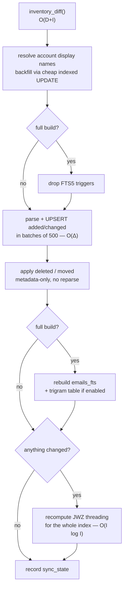

---
covers:
  - src/cobos_apple_mail_mcp/read/indexer.py
  - src/cobos_apple_mail_mcp/read/watcher.py
last_verified: 2026-06-30
---

# Indexing and `--watch`

## The key trick: filename == ROWID

A `.emlx` filename's numeric stem *is* the Envelope Index ROWID, so the indexer can diff
filesystem path sets (mtime, size) against what's already in `emails` to classify
added/changed/deleted/**moved** without re-parsing every file:

```
disk  = {path: (mtime, size) for path in walk(MAIL_DIR, "**/*.emlx")}
db    = {row.emlx_path: (row.emlx_mtime, row.emlx_size) for row in SELECT ... FROM emails}

added   = disk_paths - db_paths
deleted = db_paths - disk_paths
changed = {p for p in disk_paths & db_paths if disk[p] != db[p]}

# a delete+add pair sharing the same ROWID stem is a MOVE, not a reparse:
moved = [(old_path, new_entry) for entries sharing rowid in (added ∩ deleted by rowid)]
```

Implemented in `read/indexer.py::inventory_diff()`. A move only updates `emlx_path`,
`account_uuid`, `mailbox_name`/`role` — no reparse needed.

### Diff complexity

Let *D* = messages currently on disk, *I* = rows currently in `emails`, *Δ* = `|added| +
|changed| + |deleted| + |moved|` (what actually changed since the last run). Two different costs
are easy to conflate:

- **Computing the diff itself** is `O(D + I)` — every run has to enumerate the *entire* current
  disk inventory and the *entire* `emails` table to build the two path sets before it can take a
  set difference, even if nothing changed. This is a directory walk plus one `SELECT` over
  `emails` — cheap *per item* (a `stat()` and a row read), but linear in mailbox size regardless
  of how much mail is new.
- **Doing something about the diff** (parsing, threading, re-indexing) is `O(Δ)` — strictly
  proportional to what changed, not to *D* or *I*.

So one `--watch` tick costs `O(D + I) + O(Δ)`, not `O(D)` alone: for a personal mailbox where a
tick typically finds a handful of new messages (Δ in the single digits) against hundreds of
thousands already indexed (*D*, *I* ≈ 2×10⁵), the diff-enumeration term dominates wall-clock time,
but its per-item cost (filesystem metadata + a row read) is orders of magnitude cheaper than the
`O(Δ)` term's per-item cost (full parse, HTML→text, threading) — which is exactly why `--watch`
stays fast even against a 210k-message mailbox: the part that scales with mailbox size is cheap,
and the part that's expensive scales with new mail, not total mail.

## Crash-safe bulk build sequence



`build_index(conn, mail_dir, full=False, enable_trigram=False)`:

1. `inventory_diff()`.
2. Resolve account display names (`read/account_names.py::resolve_account_names()`, see
   [Apple Mail on-disk format](https://github.com/ErnestoCobos/cobos-apple-mail-mcp/wiki/Apple-Mail-on-disk-format#account-display-names))
   and backfill any already-indexed row whose `account_name` doesn't match yet
   (`_backfill_account_names()`) — a cheap indexed `UPDATE`, not a reparse, so it runs on every
   build, not just `--full`.
3. If `full`: drop the FTS5 triggers (so per-row inserts during the bulk parse don't also fire
   small FTS writes — batched at the end instead).
4. Parse + UPSERT `added`/`changed` entries in batches of 500
   (`read/indexer.py::_index_entries()`); each batch commits independently, so a crashed build
   resumes cleanly — the `(mtime, size)`-gated diff just re-discovers whatever wasn't committed
   yet. A path that fails to parse is recorded in `failed_index_jobs` (dead-letter) **and a path
   that previously failed but now parses successfully has its dead-letter entry cleared** — a
   real bug caught during development (the table only ever grew until this fix).
   `_flush_batch()` isolates a bad row two ways: `emlx_parser.py::_sanitize_parsed()` strips lone
   UTF-16 surrogates that `email.policy.default`'s lenient header decoding can leave in place for
   malformed/non-UTF-8 real-world headers (sqlite3 rejects those with `UnicodeEncodeError`), and
   if anything still slips through, the batch `executemany` falls back to one row at a time,
   dead-lettering only the offending row instead of losing — or aborting the build on — the whole
   500-row batch. Found running a full build against a real 209k-message, multi-account mailbox
   for the first time, which is exactly the scale where years of varied, occasionally malformed
   mail actually shows up; synthetic fixtures never hit this.
5. Apply `deleted`/`moved`.
6. If `full`: rebuild `emails_fts` (delete + `INSERT...SELECT`, **not** the bare `'rebuild'`
   command — see [Search](https://github.com/ErnestoCobos/cobos-apple-mail-mcp/wiki/Search) for why), recreate the triggers, optimize, and rebuild the
   trigram table if `enable_trigram`.
7. If anything changed: recompute JWZ threading for the whole index (`read/threader.py::
   index_threads()` — cheap enough at personal-mailbox scale to just rerun, see that page).
8. Record `sync_state` (`last_build`/`last_full_build`, `mail_dir`, `envelope_mtime`).

## `--watch`

`read/watcher.py::run_watch_loop()` reacts to filesystem events via `watchfiles` (Rust/fsevents,
debounced 500ms) and reindexes via the **same** `build_index(full=False)` path used by `index
build` — no separate incremental-update code path to keep in sync. Each tick:

- Calls `build_index`, catching and logging any exception rather than killing the loop.
- Runs `('optimize')` on the FTS index every ~2000 accumulated changes.
- If `config.embeddings.enabled`, drains a couple of small batches of the embedding backfill
  queue at low priority (`read/vector_search.py::embed_backfill(max_batches=2)`) — bounded so it
  never blocks the indexer from reacting to new mail.
- If `config.attachments.extract_text`, drains a couple of small batches of the attachment-text
  extraction queue the same way (`read/attachment_extract.py::extract_backfill(max_batches=2)`) —
  PDF/DOCX extraction is slow, so it's bounded per tick just like embeddings.
- Records `sync_state["last_watch_tick"]`.

If `watchfiles` isn't installed (the `[watch]` extra), the loop **degrades to periodic polling**
(`inventory_diff()` every 30s) rather than failing — consistent with this project's "lazy/guarded
optional dependency" rule.

A parse race (Mail.app mid-write when the indexer reads a `.emlx`) just dead-letters that one
path for this tick; it clears itself automatically once the file is stable on a later tick.

## Staleness

`index status` (`read/indexer.py::get_index_status()`) reports `total_indexed`,
`pending_added/changed/deleted` (a fresh `inventory_diff()` against the live filesystem),
`dead_letter_count`, `embed_total`/`embed_done`, and `stale: bool` — stale if there's any pending
change, or if the last build/watch tick is older than `config.index.staleness_hours` (default
24).

## What a reindex preserves vs. re-derives

Almost every `emails` column is re-derived from the `.emlx` on each reindex (the UPSERT's `ON
CONFLICT DO UPDATE` refreshes them). The deliberate exceptions — columns the UPSERT omits from its
`ON CONFLICT` update, so a reindex of an existing message preserves them:

- **`flag_color`** — has no reliable on-disk source; only ever set by this server's own
  `set_flag_color` write (an optimistic index update), never read back from disk (see
  [Apple Mail on-disk format](https://github.com/ErnestoCobos/cobos-apple-mail-mcp/wiki/Apple-Mail-on-disk-format#flag-colors)).
- **`attachment_text`** / **`attachment_extract_state`** — populated by the separate, slow
  attachment-text backfill (see [Search](https://github.com/ErnestoCobos/cobos-apple-mail-mcp/wiki/Search#attachment-content-search-optional-attachments-extra));
  a normal reindex mustn't wipe the extracted text or re-queue the (expensive) extraction.

Freshly-parsed *new* rows start `flag_color = NULL`, `attachment_text = NULL`, and
`attachment_extract_state = 0` (so the backfill picks them up).
