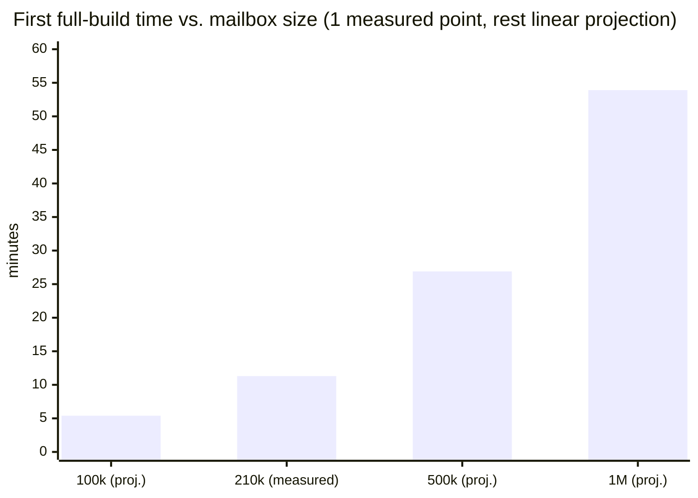

# Performance & benchmarks

## What's actually been measured vs. what's a design target

Honesty matters more than impressive numbers here. Early development timing claims were verified
only against **synthetic `.emlx` fixtures** (a handful to a few dozen messages); those code paths
were real but the numbers were extrapolated, not stress-tested. That gap has since been closed —
below are real measurements against a **real 7-account, 210,152-message mailbox**
(`apple-mail-mcp index build --full` run to completion, then queried live), alongside what's
still a synthetic-only or extrapolated number.

### Measured against a real 210,152-message mailbox

- **Full-mailbox `search`, realistic/selective query** (`"invoice"`, or `"meeting"` scoped to
  subject): **9-20ms**, BM25-ranked. This is the common case, and confirms the sub-100ms design
  target — for queries that actually narrow the corpus.
- **Full-mailbox `search`, deliberately non-selective single-word query** (`"the"`, matching
  ~82,900 of 210,152 messages — 39% of the whole mailbox): **0.3-1.6s**, not sub-100ms. Expected
  FTS5/BM25 behavior when a query barely narrows the candidate set at all — ranking tens of
  thousands of rows before returning the top page is inherently more expensive than ranking a
  few thousand. Real-world queries are essentially never this unselective, but the unqualified
  "sub-100ms at any scale" claim from before this measurement was wrong and has been corrected.
- **First full index build**: 210,152 messages in 679.6s (`IndexBuildResult.duration_sec`) — about
  3.2ms/message, one-time, includes HTML→text conversion and a full JWZ re-thread. `failed: 0` —
  see [Apple Mail on-disk format](https://github.com/ErnestoCobos/cobos-apple-mail-mcp/wiki/Apple-Mail-on-disk-format) for the malformed-header
  sanitization that made this possible; the first attempt against this same mailbox crashed
  partway through before that fix.
- `get_inbox_overview`, `get_needs_response`, `get_email_thread`: all sub-second, computed
  entirely from the local index with zero Mail.app/AppleScript involvement.
- `list_accounts`/`account` fields on every read tool: resolved to real human display names
  ("Account-A", "Account-F", etc.) via `read/account_names.py`, verified against all 7 real
  accounts on this mailbox — see [Apple Mail on-disk format](https://github.com/ErnestoCobos/cobos-apple-mail-mcp/wiki/Apple-Mail-on-disk-format#account-display-names).
- **Attachment text extraction** (optional `[attachments]` extra): a bounded backfill over 100
  real attachment-bearing messages took **3.15s — ~31.5 ms/message** on this mailbox (average
  includes fast rejection of the many `.pdf`-named attachments that aren't real PDFs; 26 of the 100
  yielded extractable PDF/DOCX text). This is meaningfully slower per message than the ~3.2 ms/msg
  headline index build, which is exactly why extraction is a separate, explicitly-triggered
  low-priority backfill (`index extract-attachments` / a couple of batches per `--watch` tick),
  **not** part of every build. The mailbox has 6,665 attachment-bearing messages (2,193 with a
  PDF/DOCX name), so a full first extraction is a one-time cost on the order of a few minutes,
  after which it's incremental.

### Measured (synthetic fixtures, low message counts)

- `search()` (`SearchResult.timing_ms`) on a handful of indexed messages: consistently
  sub-millisecond to low-single-digit milliseconds — e.g. `0.24ms`–`0.30ms` observed in
  end-to-end MCP tool-call tests. Consistent with the low-thousands-of-messages case of the real
  mailbox above.
- `--read-only` blocking a write tool: ~1-6ms (a real regression was caught and fixed here — an
  earlier version took **~20 seconds** because it resolved the message via JXA before checking
  `--read-only`; see [Safety, confirmation & undo](https://github.com/ErnestoCobos/cobos-apple-mail-mcp/wiki/Safety-confirmation-and-undo)).

### Still a design target, not directly measured

- Index build vs. scripting Mail.app for the same scan: this project has not run a literal
  head-to-head against an AppleScript-based scanner. The ~3.2ms/message figure above is real; the
  claim that this beats AppleScript scripting by roughly an order of magnitude or more rests on
  the architectural difference (one process-per-AppleScript-call vs. direct file I/O in a single
  process) rather than a benchmark run in this repo.
- `--watch` latency: new mail typically reflected within a couple of seconds, bounded by the
  500ms debounce window plus indexing time for the batch — not yet measured against sustained
  real mail arrival over time.

### Verified for real (not synthetic): the `osascript` subprocess mechanics

`tests/test_jxa_executor.py` runs real `osascript` calls (no Mail.app interaction — scripts that
don't touch `Application("Mail")`, so no Automation permission needed) to verify the timeout/
process-group-kill behavior actually works: a deliberately hung script (`while (true) {}`) is
killed and returns control within the configured timeout, not Apple Events' own ~2-minute
default wait.

## Why it's fast — the complexity math

Not "trust us, it's fast" — every claim below either derives from the actual algorithm each
subsystem runs, or is checked against the real 210,152-message measurements above. *N* = total
indexed messages, *M* = mailbox size as Mail.app's own JXA layer would see it, *m* = a search's
candidate-set size, *K* = requested result-page size (`limit`, default 25), *Δ* = messages
changed since the last index build.

| Operation | Complexity | Why | Real evidence |
|---|---|---|---|
| `get_email` (single) | `O(log I)` index lookup + `O(1)` file read | B-tree row lookup by indexed column, then one bounded-size `.emlx` read — the read cost doesn't grow with mailbox size | sub-ms, measured |
| `search`, selective query | `O(m log K)`, `m ≪ N` | BM25 ranks only the *m* documents containing the (rare) term, via a size-*K* min-heap, not a full sort | 9-20ms, measured (`"invoice"`, `m`=2,745) |
| `search`, non-selective query | `O(N log K)` | a common term's candidate set ≈ the whole corpus — see [Search](https://github.com/ErnestoCobos/cobos-apple-mail-mcp/wiki/Search) for the IDF math | 289.6ms-1.6s, measured (`"the"`, `m`=82,893) |
| `mode=hybrid` (RRF fusion) | `O(K log K)` | merging two already-small top-*K* lists by rank, not by re-scoring anything | negligible vs. either underlying search — see Search |
| `index build --full` | `O(N)` | one parse + one UPSERT per message, batched | 3.23ms/message, measured (679.6s / 210,152) |
| `index build` (incremental / `--watch`) | `O(D+I)` diff + `O(Δ)` work | enumerating the current state is linear in mailbox size; only the *changed* subset gets (expensive) reparsing — see [Indexing and watch](https://github.com/ErnestoCobos/cobos-apple-mail-mcp/wiki/Indexing-and-watch) | design target (not yet load-tested against sustained arrivals) |
| JWZ re-threading (full) | `O(I)` average, `O(I log I)` worst case | one pass building containers + hash-map linking by Message-ID/References; the subject-fallback merge needs a sort of the orphan roots | see [Threading and knowledge](https://github.com/ErnestoCobos/cobos-apple-mail-mcp/wiki/Threading-and-knowledge) |
| `resolve()` (write-target lookup) | `O(1)` amortized (hint/cache/seed hit), `O(M)` worst case (broad scan) | a scoped JXA call costs Mail.app one mailbox's worth of searching; only the last-resort broad scan is unscoped | see [Identity & resolution](https://github.com/ErnestoCobos/cobos-apple-mail-mcp/wiki/Identity-and-resolution) |
| `--read-only` rejection | `O(1)` | a config check runs *before* resolution or any JXA call | ~1-6ms, measured (was ~20s before a real regression fix) |

### Throughput, derived from the one real data point we have

```
c = T / N = 679.5977 s / 210,152 messages ≈ 3.233 ms/message
throughput = N / T ≈ 309.2 messages/second
```

Treating the indexer as `T(N) ≈ c·N` (justified by the `O(N)` complexity above, and by `failed: 0`
meaning no per-message retries skewed the constant) gives a **linear projection** — explicitly
not a second measurement — for mailbox sizes not tested here:



If a real mailbox at one of the projected sizes is ever benchmarked, replace the corresponding bar
with a measured value rather than trusting the line — `c` was fit to exactly one machine, one
disk, one mailbox's content mix (attachment sizes, HTML-vs-plaintext ratio all affect it).

## Running your own benchmark

```bash
apple-mail-mcp index build --full --verbose
apple-mail-mcp index status        # total_indexed, dead_letter_count, embed coverage
time apple-mail-mcp search "some term" --highlight
```

If you benchmark against your own mailbox and the numbers differ meaningfully from the design
targets above, that's genuinely useful signal — please open an issue with `index status` output
and mailbox size.
