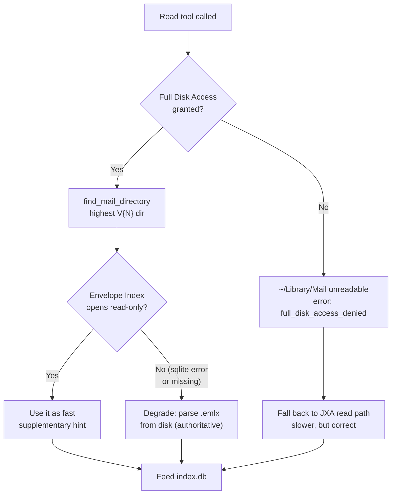
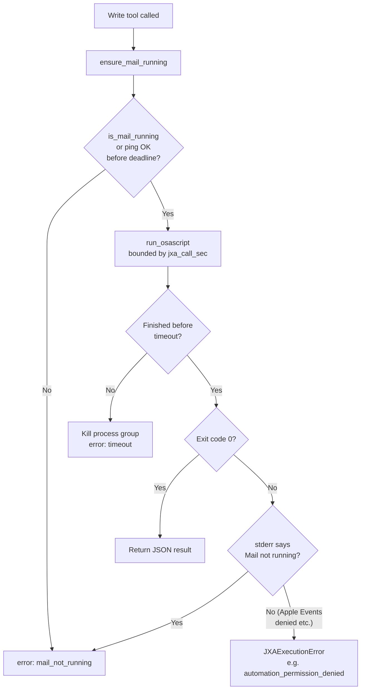

# Permissions & troubleshooting

## Required macOS permissions

_Read-path decision tree: with Full Disk Access, reads go disk-direct via find_mail_directory and the read-only Envelope Index (degrading to .emlx parsing on any sqlite error); without it, ~/Library/Mail is unreadable (full_disk_access_denied) and reads fall back to the slower JXA path._

1. **Full Disk Access** — for whatever process runs `apple-mail-mcp` (your terminal, or the MCP
   client host process if it launches the server itself) to read `~/Library/Mail`. System
   Settings → Privacy & Security → Full Disk Access → add the relevant app/binary, then restart
   it.
2. **Automation** (Apple Events) — for the same process to control Mail.app via AppleScript/JXA.
   macOS prompts for this automatically on first write attempt; if denied, re-grant under System
   Settings → Privacy & Security → Automation.
3. **Mail data access** — covered by the above two; no separate Mail.app-specific toggle exists
   beyond Automation.

`apple-mail-mcp index status` and `apple-mail-mcp init` probe what they can and emit an
actionable error rather than failing silently. If Full Disk Access is missing the server still
**starts** — it never crashes on the missing grant (`find_mail_directory()` degrades to `None`
instead of raising `PermissionError`) — and logs a clear warning; read/search/index tools report
`full_disk_access_denied` until the grant is in place, while write tools (Mail.app scripting, gated
by Automation, not Full Disk Access) keep working.

### "Server disconnected" right after registering with an MCP client

If a client (e.g. Claude Desktop) shows the server connect and then immediately disconnect, and its
logs contain `PermissionError: [Errno 1] Operation not permitted: '.../Library/Mail'`, the **client
app itself** lacks Full Disk Access. A GUI client launches the server as a subprocess, so the
server runs under the *client's* TCC identity — a grant to your terminal doesn't transfer. Grant
Full Disk Access to the client app (System Settings → Privacy & Security → Full Disk Access →
enable e.g. Claude), then **fully quit and reopen it** (Cmd-Q, not just closing the window). From
**v0.2.1** the server no longer crashes here — it starts and logs the warning above — but it still
needs the grant to read any mail. (A write-only Apple Mail MCP server that never touches
`~/Library/Mail` won't hit this; the fast on-disk read path is exactly what needs the grant.)

### What else gets read, beyond `~/Library/Mail`

Resolving human account display names (`list_accounts`, and the `account` field on every read
tool) reads `~/Library/Accounts/Accounts4.sqlite` — macOS's system-wide Internet Accounts store,
which also backs Calendar/Contacts/Messages account configuration, not just Mail (see
[Apple Mail on-disk format](https://github.com/ErnestoCobos/cobos-apple-mail-mcp/wiki/Apple-Mail-on-disk-format#account-display-names)
for why this second database is necessary — Mail's own on-disk data has no display-name mapping).
It's opened read-only/immutable, the same discipline as the Envelope Index. No separate
permission prompt appears for it: the Full Disk Access grant above already covers everything
under `~/Library`, including this file. If it's ever missing, unreadable, or shaped unexpectedly,
resolution fails silently per-account and that account's raw UUID is shown instead — this never
blocks indexing or any other tool.

## Common errors

_Write-path permission gates: ensure_mail_running (mail_not_running if Mail never becomes scriptable), then the bounded osascript call whose expiry triggers a process-group kill (timeout), whose non-zero exit is parsed for 'not running' (mail_not_running) versus any other stderr such as a denied Apple Events grant (automation_permission_denied)._

| Error code | Likely cause | Fix |
|---|---|---|
| `full_disk_access_denied` | Full Disk Access not granted to the process running the server | Grant it, restart the process |
| `mail_not_running` | A write tool needs Mail.app running and it didn't launch within `timeouts.mail_launch_sec` | Open Mail.app manually once, or increase the timeout |
| `automation_permission_denied` | Automation permission was denied or revoked | Re-grant under Privacy & Security → Automation; the system prompt only appears once per app — if dismissed, it won't reappear automatically |
| `timeout` | A bounded `osascript` call exceeded `timeouts.jxa_call_sec`, or the resolver's broad scan exceeded its bound | A large mailbox without account/mailbox hints can be slow to scan; pass `account`/`mailbox` to narrow the search, or increase the timeout |
| `not_found` | No message matches the given `message_id` (+ hints) | Confirm the id is current — it may have been superseded (drafts) or the message deleted |
| `multiple_matches` | The same Message-ID exists in more than one mailbox/account and no hint disambiguates | Pass `account`/`mailbox` from the `candidates` list in the error |
| `read_only_mode` | The server is running with `--read-only` | Restart without `--read-only`, or use the read/knowledge tools only |
| `batch_limit_exceeded` | More messages requested than `config.batch_limits.<kind>` allows | Split into multiple calls, or raise the limit in config (deliberately not silently truncated) |
| `confirmation_required` | `permanent_delete`/`empty_trash` called without `confirm=true` | Review the returned preview, then re-call with `confirm=true` |

## Index seems stale / search misses recent mail

Run `apple-mail-mcp index status` — check `pending_added`/`pending_changed`/`stale`. If the
server isn't running with `--watch`, the index only updates when `index build` is run manually;
either run `apple-mail-mcp watch` alongside the server, or `serve --watch` to run both in one
process (the watcher runs on a daemon thread, never blocking the MCP stdio loop).

## Writes seem slow or hang

They shouldn't — every `osascript` call is bounded by `timeouts.jxa_call_sec` and killed outright
on expiry (process-group kill, not just the immediate process). If a call still seems to hang
past that timeout, check whether a macOS permission dialog (Automation prompt) is waiting for
interaction on screen — those don't count against the subprocess timeout the same way and need a
human to click through once.

## Semantic search shows `degraded: true`

Either `embeddings.enabled = false` (the default), or it's enabled but the configured backend
isn't actually available (PyObjC/NaturalLanguage import failed, or the MiniLM model directory is
missing/incomplete). Search still works — it silently falls back to keyword mode. Check
`apple-mail-mcp index status` for `embed_total`/`embed_done`, or look for a "backend ... is
unavailable" warning in server logs.
