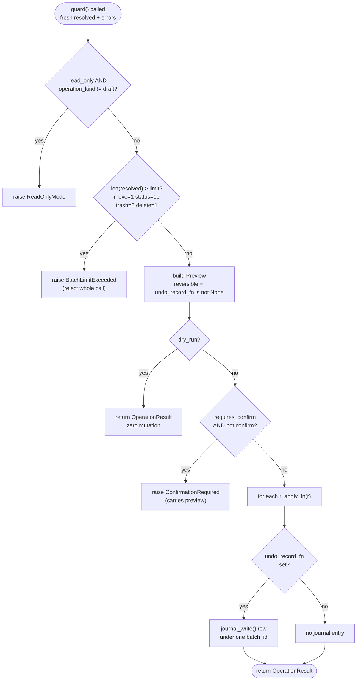

---
covers:
  - src/cobos_apple_mail_mcp/core/safety.py
  - src/cobos_apple_mail_mcp/core/undo.py
last_verified: 2026-07-01
---

# Safety, confirmation & undo

`core/safety.py::guard()` is the single wrapper every write tool passes through. No write tool
calls `write/*.py` directly.

## `guard()` checks, in order



_The guard() control flow: read_only, then batch-limit, then Preview build, then dry_run short-circuit, then confirm gating, then apply_fn per message, and finally undo-journaling only when undo_record_fn was supplied._

1. **`--read-only`** (`config.server.read_only`) blocks every send/modify operation —
   `operation_kind != "draft"`. Draft creation stays allowed (it mutates nothing the user already
   has). Checked **before** resolution is attempted in the batch write tools
   (`write/organize.py::_require_writable()`) so a blocked call never touches JXA/Mail.app at
   all — confirmed by `tests/test_write_layer.py::test_read_only_blocks_before_any_jxa_call`,
   which catches a real regression where an earlier version resolved first and only checked
   read-only inside `guard()`, adding a real (and once observed: ~20-second) JXA round-trip to
   every blocked call.
2. **Batch limits** (`config.batch_limits`: `move=1, status=10, trash=5, delete=1` by default) —
   exceeding the limit **rejects** the whole call (`BatchLimitExceeded`), it never silently
   truncates to the first N messages.
3. **`dry_run`** — runs full resolution (so the preview reflects exactly what would be acted on,
   including any `MultipleMatches`/`NotFound`), performs zero mutation, returns a `Preview`.
4. **`confirm`** — operations in `config.confirmation.require_confirm` (`permanent_delete`,
   `empty_trash` by default) need `confirm=true`; otherwise `ConfirmationRequired` is raised,
   carrying the preview. Because resolution is always redone fresh on every call (never trusting
   a stale snapshot), a confirmed call naturally re-validates against current mailbox state —
   there's no separate "stale confirmation token" mechanism needed.

## What's actually undoable


_Classification of write operations by undoability: move, trash-until-emptied, and status/flag are journaled and reversed by undo_last() via _undo_move or _undo_status, while permanent delete, empty_trash, and send/reply/forward are never journaled and never undoable._

| Operation | Undoable? | Mechanism |
|---|---|---|
| move | Yes | `core/undo.py::_undo_move()` re-resolves at the new location and moves back |
| trash (move_to_trash) | Yes, until emptied | journaled as a move to "Trash"; reversing moves it back to the recorded origin mailbox |
| mark_read/unread, flag/unflag | Yes | the prior `is_read`/`is_flagged` value (read from the index at write time) is restored |
| set_flag_color | Yes | the prior `flag_color` (read from the index at write time) is restored — a `set_flag_color` back to the old color, or `unflag` if it was previously uncolored |
| permanent delete | **No** | never journaled — `manage_trash(action="delete_permanent")` passes `undo_record_fn=None` |
| empty_trash | **No** | a separate function (`organize.py::empty_trash()`), not journaled |
| send/reply/forward | **No** | never journaled — sending cannot be undone |

`undo_last(batch_id=None, dry_run=False)`:

- With no `batch_id`, finds the most recent batch with an undoable operation
  (`operation IN ('move','trash','mark_read','mark_unread','flag','unflag','set_flag_color')`) and
  reverses it.
- Each row's reversal goes through the normal resolve+JXA path again — if the message has moved
  again or been deleted since, that row's undo fails with a clear per-row reason
  (`UndoResult.failed`), while the rest of the batch still attempts to undo.
- The journal retains the last 500 batches (`core/undo.py::MAX_RETAINED_BATCHES`); older batches
  are pruned automatically on every write.

## `undo_journal` schema

```sql
CREATE TABLE undo_journal (
  id INTEGER PRIMARY KEY, ts REAL NOT NULL, batch_id TEXT NOT NULL,
  operation TEXT NOT NULL, canonical_id TEXT NOT NULL,
  account_name TEXT, from_mailbox TEXT, to_mailbox TEXT,
  prev_state TEXT, new_state TEXT,           -- JSON, for status/flag operations
  undone INTEGER NOT NULL DEFAULT 0, undo_ts REAL
);
```

One `batch_id` per tool call; one row per affected message. `account_name` (despite the column
name) stores the JXA-addressable account name, not the disk UUID — see
[Identity & resolution](https://github.com/ErnestoCobos/cobos-apple-mail-mcp/wiki/Identity-and-resolution).

## Honesty over completeness

The undo system does not pretend to cover everything. `Preview.reversible` and `Preview.undo_hint`
tell the caller up front whether an operation can be undone at all, and permanent
delete/empty-trash/send are reported as non-undoable rather than silently accepted with a fake
promise of recoverability.

## Non-batch writes: rule lifecycle (`gate_nonbatch`)

`guard()` is built around a batch of resolved messages, which doesn't fit operations on other
objects like Mail rules. Those go through `core/safety.py::gate_nonbatch()` — the same
read-only / dry-run / confirm discipline, minus the message-batch machinery. It raises
`ReadOnlyMode` under `--read-only`, returns the preview dict on `dry_run` (caller mutates nothing),
raises `ConfirmationRequired` when confirmation is needed but absent, and otherwise returns `None`
to proceed.

`enable_rule`/`disable_rule` just need read-only + dry-run (they're trivially reversible by the
opposite call). **`delete_rule` always requires `confirm=true`** — not via `config.confirmation`
(an older `config.toml` generated before this feature wouldn't list it, silently dropping the
gate), but unconditionally in code, because a deleted rule is strictly *more* destructive than a
deleted message: Mail's scripting cannot recreate a rule at all (see
[Tools reference](https://github.com/ErnestoCobos/cobos-apple-mail-mcp/wiki/Tools-reference#mail-rules-toolswrite_toolspy--writerulespy-jxa-backed)).
It is therefore not journaled/undoable, and `delete_rule` is included in the default
`require_confirm` list for discoverability even though the code enforces confirmation regardless.

## Unsubscribe: a sender-controlled URL

`unsubscribe_from_sender` (`write/unsubscribe.py`) is an outbound action gated by `--read-only`
like any send, but it also crosses a distinct trust boundary the other write tools don't: the
target of the RFC-8058 one-click POST comes from a **sender-controlled** header
(`List-Unsubscribe`). So before any request:

- **https only.** The POST target must start with `https://`; `_post_one_click()` refuses anything
  else, and a non-https URI never even lands in the candidate list (`emlx_parser.py::
  extract_unsubscribe()` only collects `https:` URIs, so `http://` or exotic schemes are ignored,
  not fetched).
- **No downgrade on redirect.** A custom `HTTPRedirectHandler` refuses to follow a 3xx to any
  non-https location, so the sender can't bounce the request onto `http://`/`file://`.
- **Bounded.** The request has a hard timeout (`config.timeouts.http_sec`, default 15s) — the
  never-hang rule (invariant #4) applies to network calls, not just `osascript`.
- **Honest result.** Returns `method=one-click-post|mailto|none-found` (with `ok` and `detail`),
  never a bare boolean, so the caller can tell a real unsubscribe from "this sender offers no
  standard method, nothing happened". Not journaled/undoable (you can't un-send an unsubscribe).
