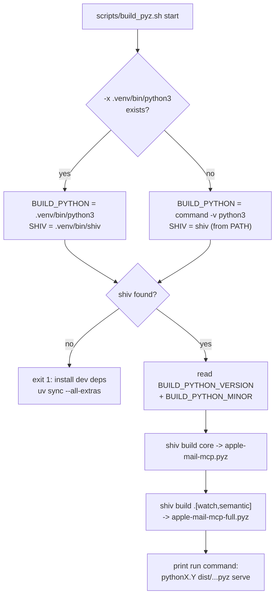
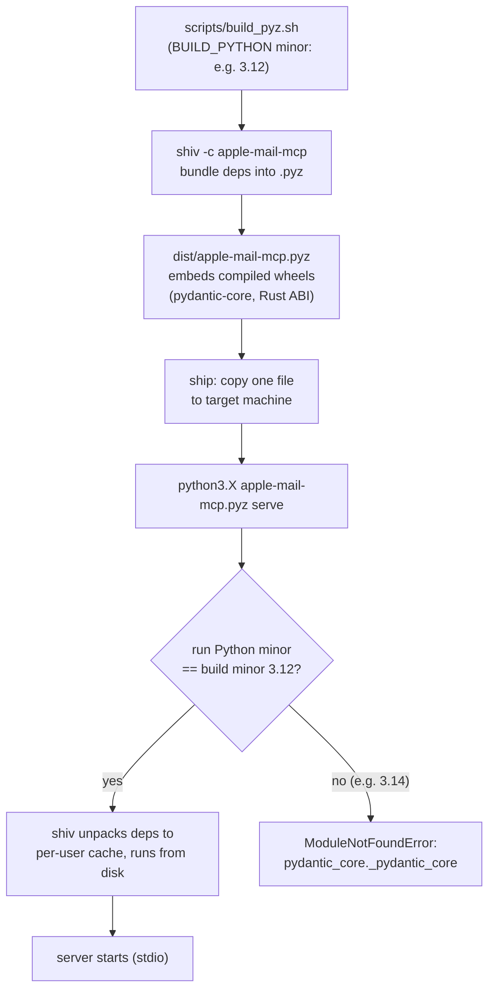

---
covers:
  - scripts/build_pyz.sh
  - pyproject.toml
last_verified: 2026-07-01
---

# Single-file packaging (`apple-mail-mcp.pyz`)

A first-class distribution option alongside pipx/uvx/pip: one self-contained file that runs with
just a Python 3.10+ interpreter on `$PATH` — no `pip install` step.

## Build



_Build-time interpreter selection in build_pyz.sh: it prefers the project .venv's python3/shiv over whatever is first on PATH, bails out if shiv is missing, then builds both the core and full .pyz artifacts and prints the exact run command._

```bash
make pyz
# or directly:
scripts/build_pyz.sh
```

Produces two artifacts in `dist/`:

- `apple-mail-mcp.pyz` — the core server (read/search/knowledge/write), no `[watch]`/`[semantic]`.
- `apple-mail-mcp-full.pyz` — bundles `[watch]` (incremental indexing) and `[semantic]` (hybrid
  search) as well.

Built with [`shiv`](https://github.com/linkedin/shiv): on first run, the zipapp unpacks its
bundled dependencies (including precompiled wheels like `pydantic-core`) to a per-user cache
directory and runs from there — so it's a single file to copy/share, and the actual execution
happens from real files on disk, not zipimport. (This is also why the packaging rules below
matter less than they might seem to: shiv's bootstrap means *our own* package data ends up as
real files too, in both a normal pip install and a shiv run.)

`scripts/build_pyz.sh` prefers `.venv/bin/python3`/`.venv/bin/shiv` over whatever `python3`/`shiv`
are first on `$PATH`, falling back to `$PATH` only if no project `.venv` exists — a *build-time*
version of the exact gotcha below (a system `python3` can easily be a different minor version
than the one `uv sync --all-extras` built the venv's `shiv` against, silently producing a `.pyz`
whose declared build version doesn't match what actually built it). Run `make pyz`/
`scripts/build_pyz.sh` from a checkout with `.venv/` already set up (`uv sync --all-extras`) to
get this for free.

## Run — and a real, verified gotcha about Python versions



_Build-to-first-run lifecycle: shiv bundles ABI-specific compiled wheels into the .pyz, which unpacks to a per-user cache on first run only when the run-time Python minor version matches the build-time one; a mismatch fails with the pydantic_core import error._

```bash
python3 apple-mail-mcp.pyz init
python3 apple-mail-mcp.pyz index build
python3 apple-mail-mcp.pyz serve
```

**Verified during development, not a theoretical caveat**: the `.pyz` bundles compiled wheels
(`pydantic-core`, a Rust extension) tied to the **exact Python minor version** it was built
with. Running it with a *different* Python (e.g. built with 3.12, run with system `python3`
resolving to 3.14) fails with:

```
ModuleNotFoundError: No module named 'pydantic_core._pydantic_core'
```

This was reproduced while writing `scripts/build_pyz.sh` — even the `.pyz`'s own embedded
`#!/usr/bin/env python3` shebang doesn't save you, because `env python3` resolves to whatever
`python3` happens to be first on `$PATH` at *run* time, which may not match the *build*-time
interpreter at all. `scripts/build_pyz.sh` prints the exact Python version it built with and the
command to run it correctly; always invoke with a matching interpreter:

```bash
python3.12 apple-mail-mcp.pyz serve     # match whatever scripts/build_pyz.sh printed
```

If you distribute a built `.pyz` to others, tell them which Python minor version it requires (CI
release builds pin one specific version for this reason — see
[Development & contributing](https://github.com/ErnestoCobos/cobos-apple-mail-mcp/wiki/Development-and-contributing)).

Register with an MCP client using `"command": "python3.12", "args": ["/absolute/path/apple-mail-mcp.pyz", "serve"]`
(substitute your actual matching version) — see [Install per client](https://github.com/ErnestoCobos/cobos-apple-mail-mcp/wiki/Install-per-client).

## Architectural rules that make this work (baked in from the start)

1. **All packaged data is loaded via `importlib.resources`**, never a hardcoded
   `__file__`-relative path: `write/scripts/mail_core.js`, every `skills/<name>/recipe.yaml` +
   `prompt.md`, and `config.toml.example`. See `write/jxa_executor.py::_read_script()` and
   `skills/loader.py::_skills_root()`.
2. **Every optional dependency is imported lazily and guarded**: `watchfiles`, `sqlite-vec`,
   `pyobjc`/`NaturalLanguage`, `onnxruntime`, and `pypdf` (the `[attachments]` extra). The core
   `.pyz` runs without any of them installed, degrading each feature gracefully (see
   [Search](https://github.com/ErnestoCobos/cobos-apple-mail-mcp/wiki/Search) and
   [Indexing and watch](https://github.com/ErnestoCobos/cobos-apple-mail-mcp/wiki/Indexing-and-watch) for what each degrades to).
   Note the attachment feature deliberately uses `pypdf` (pure-Python) for PDF and stdlib
   `zipfile`+`ElementTree` for DOCX, rather than `python-docx` — the latter needs the compiled
   `lxml`, which would reintroduce the ABI-pinning problem the `.pyz` works hard to avoid.
3. **The `sqlite-vec` loadable extension** is loaded via the package's own
   `sqlite_vec.load(conn)` API (`storage/database.py::try_load_sqlite_vec()`), which resolves its
   bundled binary path itself — correct under both a normal install and a shiv-extracted run,
   since shiv unpacks real files rather than doing in-memory zipimport.

## Not the default channel

pipx/uvx/pip stays the primary, recommended install path (clean upgrades, proper dependency
resolution). The `.pyz` is the "grab one file and go" option for a machine where you don't want
to manage a Python environment. A fully Python-free binary (PyInstaller/Nuitka) is a possible
future addition, out of scope for this build.
