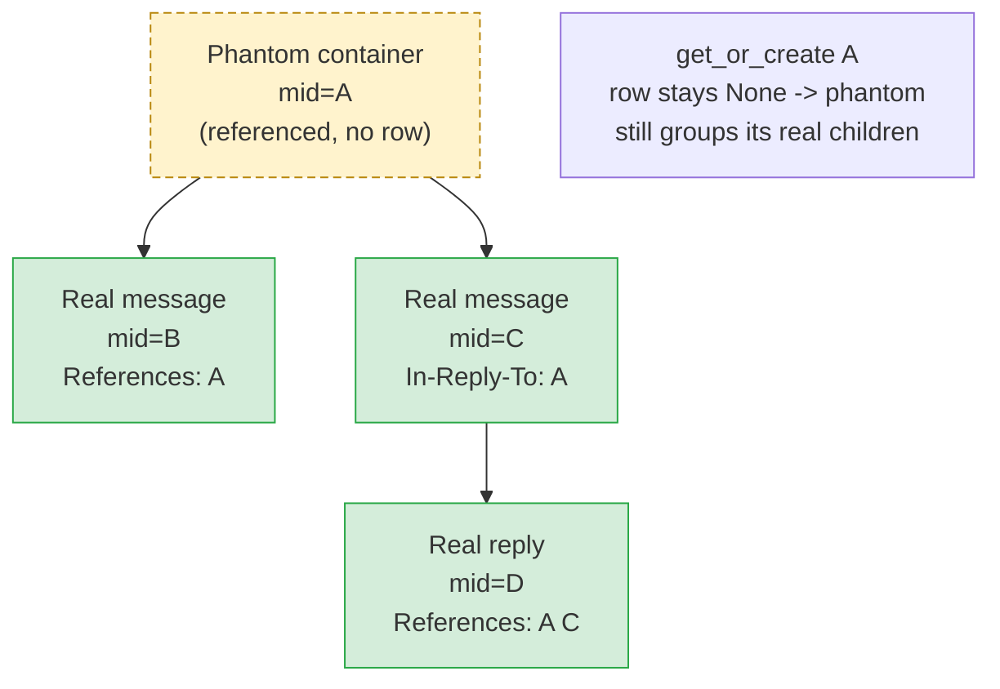
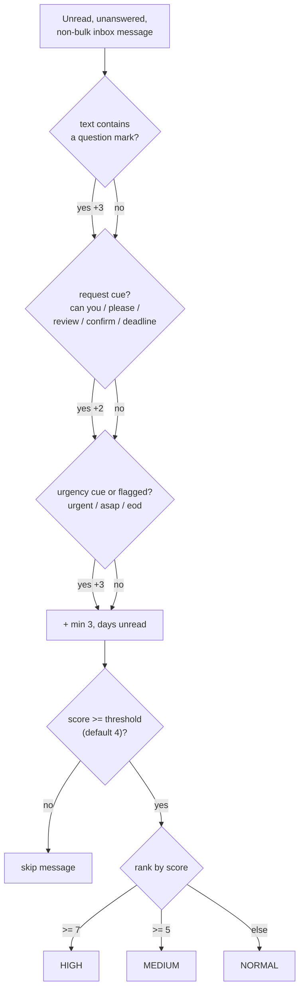

---
covers:
  - src/cobos_apple_mail_mcp/read/threader.py
  - src/cobos_apple_mail_mcp/knowledge/*.py
last_verified: 2026-06-30
---

# Threading and knowledge

Everything on this page is computed from `index.db` — never by scripting Mail.app, which would
be orders of magnitude slower for the same aggregate/graph queries.

## JWZ threading

_A phantom container (referenced Message-ID A with no indexed row) still groups its real children B, C, and D into one conversation tree._

`read/threader.py` implements the classic JWZ (Jamie Zawinski, 1997) algorithm, still the basis
of most mail clients' thread reconstruction, run entirely against indexed `message_id`/
`in_reply_to`/`references_ids` columns (no `.emlx` reparse needed):

1. Build a container per message, keyed by Message-ID. A message's `References` (or, if absent,
   `In-Reply-To`) chain links containers parent→child in order; the message itself becomes a
   child of the last reference in its chain.
2. References to a Message-ID with no corresponding row become **phantom containers** — they
   still correctly group their real children together (e.g. two replies to a message we don't
   have, perhaps because it lives in an unindexed mailbox).
3. A root-level-only fallback (`_merge_orphan_roots_by_subject()`) merges orphan threads sharing
   a normalized subject (Re:/Fwd: stripped) — for mail with missing or broken
   References/In-Reply-To headers. Deliberately restricted to roots only; merging deeper in the
   tree risks conflating unrelated threads that happen to share a subject.
4. `_link()` refuses to attach a container as its own parent or ancestor
   (`_creates_cycle()` walks the candidate parent chain checking for the child before linking) —
   a guard against malformed/circular `References` data (real mail from misbehaving senders or
   gateways can produce a header chain that references itself) turning the tree into an infinite
   loop instead of just silently dropping the one bad link.

`index_threads()` recomputes `thread_id`/`thread_root_id`/`thread_position` for the **whole**
index on every build that has any change (not just touched threads) — at personal-mailbox scale
(well under a million messages) this is a few hundred milliseconds, so the complexity of a
touched-threads-only incremental path wasn't worth it. `thread_id` is the `emails.id` of the
earliest real message in the tree.

`get_email_thread(message_id=... | thread_id=...)` re-runs JWZ on just that thread's own rows
(cheap — typically tens of messages) to reconstruct the actual parent/child tree for output,
rather than persisting a separate parent-pointer column.

## Triage heuristics

_get_needs_response accumulates +3 for a question, +2 for a request cue, +3 for urgency/flagged, plus min(3, days unread), then drops anything below the threshold and ranks the rest HIGH/MEDIUM/NORMAL._

No universally agreed definition of "needs a reply" exists in the literature — these are
transparent, tunable heuristics, not a black-box classifier.

**`get_awaiting_reply(days_back=7, account=None)`** (`knowledge/triage.py`): scans Sent messages
in the window, extracts the primary `To` recipient, skips anything that looks like a no-reply
address (`core/text.py::looks_like_noreply()`), and checks whether any later message from that
recipient has `in_reply_to` matching the sent message's id, references it, or shares its
normalized subject — scoped to candidates from that recipient after the send date, to avoid a
fragile substring `LIKE` over the references column. Sorted by longest-waiting first, capped at
20 results.

**`get_needs_response(days_back=7, account=None, threshold=4)`**: scores unread, unanswered,
non-bulk inbox messages —

- +3 if the subject/snippet contains a question mark
- +2 for a request-phrase cue (`can you`, `please`, `review`, `confirm`, `deadline`, ...)
- +3 for an urgency cue (`urgent`, `asap`, `eod`, ...) or the message is flagged
- +min(3, days unread)

— filters out anything from a no-reply address, ranks `HIGH` (≥7) / `MEDIUM` (≥5) / `NORMAL`,
and reports the matched `reasons` alongside the score.

Both heuristics filter bulk/newsletter mail at parse time, not query time: `read/emlx_parser.py::
_looks_bulk()` checks `List-Unsubscribe`, `List-Id`, `List-Post`, `Precedence: bulk|list|junk`,
and `Auto-Submitted` headers, persisted as `emails.flag_bulk`.

## Analytics

`knowledge/analytics.py` — `get_inbox_overview()` (counts, top unread senders, needs-response/
awaiting-reply totals, newest unread), `get_top_senders()` (grouped/ranked by volume),
`get_statistics(scope ∈ {account_overview, sender_stats, mailbox_breakdown})` — all plain
aggregate SQL over `emails`.

## Contacts

`knowledge/contacts.py::get_contact(address)` — message count, last-contact date, and the 5 most
recent messages **received from** an address, derived purely from the index (no integration with
macOS Contacts/AddressBook — out of scope).

`knowledge/contacts.py::list_contacts(query=None, account=None, limit=25)` — a browsable,
searchable contact list. **Bidirectional by design**: it counts both mail received from an address
(grouped `sender_addr`, using SQLite's well-defined "bare column beside `MAX()` comes from the
max row" rule to pick each address's latest display name in one pass) *and* mail sent to it
(recipients on `mailbox_role='sent'` rows). The received half is a single GROUP-BY; the sent half
can't be — recipients are stored as JSON in `recipients_to`/`recipients_cc`, not a joinable column
— so it's a bounded Python merge over sent rows (`email.utils.getaddresses` expands each recipient
list), fine at personal-mailbox scale. The two halves merge on a lowercased address key, so
`Dave@x.com` and `dave@x.com` collapse to one contact. A sender-only list was rejected because it
silently omits people the user emails but who rarely reply — verified against a real mailbox where
15 contacts had a non-zero sent count that a received-only list would have hidden. Ranked by
combined volume, or substring-filtered on name+address when `query` is given. Returns
`ContactSummary` (address, display_name, received_count, sent_count, total_count, last_contact) —
deliberately without `Contact.recent_messages`, which is too heavy for a list projection. The
single-contact `get_contact()` stays received-only.
